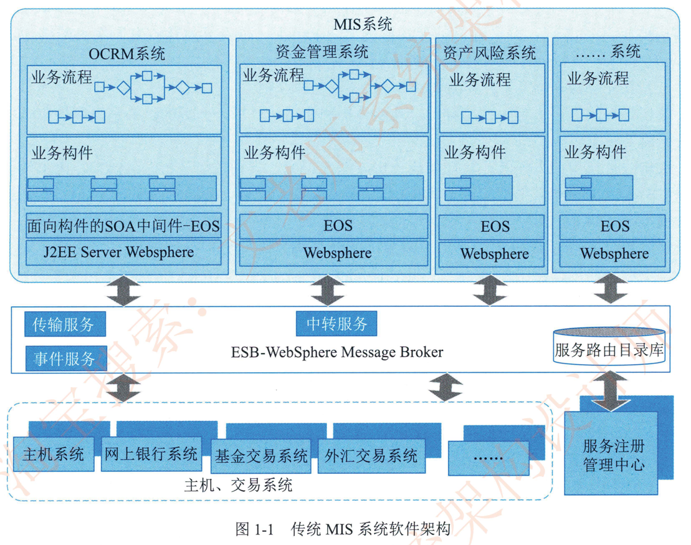

# 1.1.1系统架构的定义及发展历程

## 1.系统架构的定义

这里的架构 (Architecture) 定义来源于 IEEE 1471-2000：”EEE's Recommand Practice for Architectural Description Of Software-Intensive Systems.“标准,本标准主要针对软件密集系统进行了架构描述。其对架构定义如下:

**架构**是体现在组件中的一个系统的基本组织。它们彼此的**关系**与环境的关系及指导它的设计和发展的原则

**系统**是组织起来完成某一特定功能或一组功能的组件集。系统这个术语包括了单独的应用程序、传统意义上的系统、子系统、系统之系统、产品线、整个企业及感兴趣的其他集合。系统用于完成其环境中的一个或多个任务。

**环境**或者**上下文**决定了对这个系统的开发、运作、政策以及会对系统造成其他影响的环境和设置。

**任务**是由一个或者多个利益相关者通过系统达到一些目标的系统的一个用途或操作。

通俗地说，系统架构 (System Architecture) 是系统的一种整体的高层次的结构表示，是系统的骨架和根基，支撑和链接各个部分，包括组件、连接件、约束规范以及指导这些内容设计与演化的原理，它是刻画系统整体抽象结构的一种手段。系统架构设计的目的是对需要开发的系统进行一系列相关的抽象。用于指导系统各个方面的设计与实现，架构设计在系统开发过程中起着关键性作用，架构设计的优劣决定了系统的健壮性和生命周期的长短。我们通常把架构设计作为系统开发过程中需求分析阶段后的一个关键步骤，也是系统设计前的不可或缺工作要点之一，架构设计的作用主要包括以下几点:

- 解决相对复杂的需求分析问题;

- 解决非功能属性在系统占据重要位置的设计问题;

- 解决生命周期长。扩展性需求高的系统整体结构问题;

- 解决系统基于组件需要的集成问题;

- 解决业务流程再造难的问题。

系统架构设计是成熟系统开发过程中的一个重要环节,它不仅是连接用户需求和系统进-步设计与实现的桥粱,也是系统早期阶段质量保证的关键步骤。

软件架构 (也可称为体系结构)是用来刻画软件系统整体抽象结构的一种手段。软件架构设计也是软件系统开发过程中的一个重要环节。随着研究的深入和应用的推广，软件架构逐渐成为软件工程学科的重要分支方向，在基础理论和技术方向等各工程实践领域形成了自己的独特理念和完整体系。

## 2.发展历程

系统架构的发展历程可追溯到 20世纪60年代中期爆发的一场大规模软件危机，其突出表现是软件生产不仅效率低，而且质量差，究其原因，主要是因为软件开发的理论和方法不够系统。技术手段相对落后，软件生产主要是手工作坊式。为了解决软件危机，北大西洋公约组织(NATO) 分别于 1968年和 1969年连续召开两次著名的软件会议 (即 NATO 会议) ，提出了软件工程的概念，发展了软件工程的理论和方法，为今后的软件产业的发展指明了方向。

但是随着软件规模的进一步扩大和软件复杂性的不断提高。新一轮的软件危机再次出现。1995年，Standish Group 研究机构以美国境内 8000 个软件工程项目为调查样本进行调查。其结果显示，有 84%的软件项目无法按时按需完成,超过30%的项目天折,工程项目耗费超出预算189%，软件工程遭遇到了前所未有的困难。

通过避免软件开发中重复劳动的方式提升软件开发效率并保障软件质量，软件重用与组件化成为解决此次危机行之有效的方案。随着软件组件化开发方式的发展，如何在设计阶段对软件系统进行抽象。获取系统蓝图以支持系统开发中的决策成为迫切而现实的问题，分析问题的根源和产生的原因，以下现象应该获得关注:

1. 软件复杂。易娈。其行为特征难以预见。 软件开发过程中需求和设计之间缺乏有效的转换。导致软件开发过程困难和不可控。

2. 随着软件系统的规模越来越大,越来越复杂,整个系统的结构和规格说明就显得越来越重要。

3. 对于大规模的复杂软件系统。相较于对计算算法和数据结构的选择,系统的整体结构设计和规格说明己经娈得明显重要得多。

4. 对软件系统结构的深入研究将会成为提高软件生产率和解决软件维护问题的最有希望的新途径。

在这种情况下，软件架构应运而生。

20世纪 90年代。研究入员展开了对软件架构的基础研究，主要集中于架构风格(模式)，架构描述语言，架构文档和形式化方法。众多研究机构在促进软件架构成为一门学科的过程中发挥了举足轻重的作用。例如，美国卡内基-梅隆大学的 Mary Shaw 和 David Garland 的专著推广了软件架构的概念，即组件、连接件和风格的集合。美国加州大学欧文分校针对架构风格、架构描述语言和动态架构也开展了深入的研究。

软件架构自概念诞生以来。大致经历了四个发展阶段:

### 1）基础研究阶段 (1968--1994年 )

“软件架构”术语在 1968年由北大西洋公约组织会议上笫一次提出,但并没有得到明确的定义。直到20世纪 80年代, “架构” 一词在大多数情况下被用于表示计算机的物理结构，偶尔用于表示计	算机指令集的特定体系。从20年代 80年代起,为应对大型软件开发中存在的危机,对软件结构进	行描述的方法开始在大型软件开发过程中广泛应用。并在实践中积累了大量经验，逐步形成了以	描述软件高层次结构为目标的体系。形成了软件架构的雏形。随着软件规模的增大。模块化开发	方法已被逐步采用,为后续软件架构的发展奠定了基础。

模块化开发方法是指把一个待开发的软件分解成若千个小的而且简单的部分，采用对复杂事物分而治之的经典原则=模块化开发方法涉及的主要问题是模块设计的规则。即系统如何分解成模块。而每一模块都可独立开发与测试。 最后再组装成一个完整软件。对一个规约进行分解。以得到模块系统结构的方法有数据结构设计法。功能分解法。数据流设计和面向对象的设计等。将系统分解成模块时 ，应该遵循以下规则:

1.  最高模块内聚。也就是在一个模块内部的元素最大限度地关联，只实现一种功能的模块是高内聚的，具有三种以上功能的模块则是低内聚的。
2. 最低耦合。也就是不同模块之间的关系尽可能弱，以利于软件的升级和扩展。
3. 模块大小适度。颗粒过大会造成模块内部维护困难。而颗粒过小又会导致模块间的耦合增加。
4. 模块调用链的深度（嵌套层次）不可过多 。
5. 接口简单。精炼 （扇入扇出数不宜太大），具有信息隐蔽能力。
6. 尽可能地复用己有模块。

模块化的思想推动了软件架构的快速发展。此时，恰逢全球信息技术的大力发展，企业一方面需要提高业务的灵活性和创新能力;  另一方面随着 IT 环境的复杂度和历史遗留系统的增加，企业面临着新的挑战。模块化方法恰恰可帮助企业从根本上解决这一问题，它一方面通过抽象、封装、分解、 层次化等基本科学方法。对各种软件组件和软件应用进行打包。提高对企业现有资产的重用水平和能力;  另一方面，基于模块化思想，业界提出了面向对象服务架构(Service-Oriented Architecture，SOA) 思想，它提供一组基于标准的方法和技术。通过有效整合和重用现有的应用系统和各种资源实现服务组件化，并基于服务组件实现各种新业务应用的快速组装。帮助企业更好地应对业务的灵活性要求。这样，通过有效平衡业务的灵活性和 IT 的复杂度，为开发者提供了新的视角，有效拉近了 IT 和业务的距离到20世纪 90年代末期。计算机的发展推动了企业管理自动化的步伐，管理信息系统 (Management Information System，MIS)在企业中得到了广泛使用。与此同时， IT 业为了降低开发成本，解决业务需求的易娈性。实现软件模块的重用。考虑将企业业务与数据处理相分离的分层思想，这也是软件架构的初步雏形。图1-1给出传统 MIS 系统的架构。

### 2）概念体系和核心技术形成阶段（1999--2000年）

软件架构概念体系的建设始于20世纪 90年代，Windton W.Royce 与 Waiker Royce 在 1991年首次对软件架构进行了定义。1992年 D.EPery 与 A.L.Wolf 对软件架构进行了创造性的阐述: `{elements，forms，rationale} =software`，使之成为后续软件架构概念发展的基础。1996年，卡内基-梅隆大学软件工程研究所 (CMUISEI)的Shaw 和 David Garlan 在 *SoftwareArchitecture: Perspectives on an Emerging Discipline* 书中对软件架构概念的内涵和外延进行了详尽阐述。这对软件架构概念的形成起到了至关重要的作用

从 1995 年起。软件架构研究领域开始进入快速发展阶段。来自于工业界与学术界的研究成果大量出现，使得软件架构作为一个技术领域日渐成熟Booch  Runbaugh 和 Jacobson 从另一个角度对软件架构的概念进行了全新诠释，认为架构是一系列重要决策模式同时，由某个软件研究机构提出了一套实践方法体系-SAAM。企业界也提出并完善了多视角软件架构表示方法以及针对软件架构的特定设计模式Siemens、Nokia 、Philips、 Nortel、IBM 以及其他一些大型软件开发组织开始关注软件架构，并联手进行了软件产品线架构的重用性调查。

2000年，IEEE 1471-2000 标准的发布第一次定义了软件架构的形式化标准。这标志着软件架构理论体系己基本建立。并已具备普及应用的基础。这一阶段最重要的成果之一就是软件组件化技术。通过沿用20世纪的工业组件概念，提升了软件重用能力和质量。

通常，组件具有可组装性和可插拔性，每个组件的运行仅依赖于平台或者容器，组件与组件之间不存在直接的耦合关系。同时，组件和组件之间又并非绝对独立。组件经过组装后可以与其他组件进行业务上的交互。组件化开发并不等同于模块化开发。模块化开发只是在逻辑上做了切分。物理上〈代码）通常并没有真正意义上的隔离。组件化也不等同于应用集成，应用集成是将一些基于不同平台或不同方案的应用软件有机地集成到一个无缝的并列的。易于访问的单一系统中，以建立一个统一的综合应用组件化比模块化更独立，但比应用集成结合得更加紧密
### 3 ）理论体系完善与发展阶段 （1996年至今 ）
随着基于组件软件架构理论的建立，与之相关的一些研究方向逐渐成为软件工程领域的研究重点，主要包括： 软件架构描述与表示、软件架构分析、设计与测试； 软件架构发现、演化与重用； 基于软件架构开发方法； 软件架构风格； 动态软件架构等。

1.  软件架构描述与表示。

	目前存在多种软件架构描述语言，比较典型的是基于组件和消息的软件架构描述语言C2SADL， 分布，并发类型的架构描述语言 Wright，架构互换语言 ACME，基于组件和连接的架构描述语言 UniCon，基于事件的架构描述语言 Rapide，以及其他比较有影响力的描述语言Darwin，MetaH、Aesop、Weaves，SADLXADL 等。

2. 软件架构分柝、设计和测试架

	构分析的内容可分为结构分析。功能分析和非功能分析。分析的目的是系统被实际构造之前预测其质量属性。

	架构分析常用的方法有：  软件架构分析方法 SAAM  架构权衡分析法 ATAM， 成本效益分析法 CBAM ， 基于场景的架构再工程 SBAR 架构层次的软件可维护性预测 ALPSM， 软件架构评估模型 SAEM 等架构设计是指生成一个满足用户需求的软件架构过程=架构设计常用的方法有：  从工件描述中提取架构描述的工件驱动 （artifact-driven） 方法；  从用例导出架构抽象的用例驱动Case-driven ） ；从模式导出架构抽象的模式驱动 （patter-driven） 方法；  从领域模型导出架构抽象的域驱动 （domain-driven） 方法以及从设计过程中获得架构质量属性需求的属性驱动设计attribute-driven design _方法等。架构测试着重于仿真系统模型。解决架构层的主要问题。由于测试的抽象层次不同，架构测试策略分为单元。子系统。集成和验收测试等阶段的测试策略。测试方法主要包括架构测试覆盖方法组件设计正确性验证方法和基于 CHAM 的架构动态语义验证方法等。

3. 软件架构发现。

	演化与重用软件架构发现解决如何从己经存在的系统中提取软件架构的问题，属于逆向工程。Vaters等入提出了一种迭代式架构发现过程。软件架构演化即由于系统需求。技术。环境和分布等因素的娈化而最终导致软件架构的娈动。软件系统在运行时刻的架构娈化称为架构动态性，而将架构的静态修改称为架构扩展。架构扩展和动态性都是架构适应性和演化的研究范畴。软件架构复用属于设计重用，比代码重用更抽象。架构模式就是架构复用的一种成果。

4. 基于软件架构的开发方法。

	软件开发模型是跨越整个软件生存周期的系统开发。运行和维护所实施的全部工作和任务的结构框架，给出了软件开发活动各个阶段之间的关系。通常软件开发模型可分为三种：  以软件需求完全确认为前提的瀑布模型；  在软件开发初期只能提供基本需求为前提的渐进式开发模型 （如螺旋模型等）；以形式化开发方法为基础的变换模型

5. 软件架构风格。

	架构风格 （架构模式）是针对给定场景中经常出现的问题提供的一般性可重用方案。它反映了领域中众多系统所共有的结构和语义特征，并指导如何将各个模块和子系统有效地组成一个完整的系统。通常，将软件架构风格分成主要五类 （David Garland 和Shaw 划分方式）：数据流风格、调用/返回风格、独立组件风格、虚拟机风格和仓库风格。

### 4）普及应用阶段 （2000年至今 ）

在软件架构的发展历程中， 1999 年是一个关键年份。这一年召开了第一届 IFIP 软件架构会议，并成立了  IFIP 工作组2.0与全球软件架构师协会。许多企业开始将软件架构相关理论投入实践，为了使架构描述能够在实践中得到更广泛的应用， Open Group 提出了 ADML，它是一种基于 XML 的架构描述语言，支持广泛的架构模型共享。由于企业对重用以及产品族的形成有着更多考虑，因此，软件产品线成为软件架构的一个重要分支。吸引了大量大型企业的关注。软件产品线架构表示一组具有公共的系统需求集的软件系统。它们都是根据基本的用户需求对标准的产品线架构进行定制，将可重用组件与系统独立的部分集成而得到的。

软件架构是软件生命周期中的重要产物，它影响软件开发的各个阶段。

- 需求阶段： 把软件架构有的概念引入需求分析阶段。有助于保证需求规约和系统设计之间的可追踪性和一致性。

- 设计阶段： 设计阶段是软件架构研究关注最早最多的阶段。这一阶段的软件架构主要包括软件架构的描述。软件架构模型的设计与分析以及对软件架构设计经验的总结与复用等。

- 实现阶段：将设计阶段设计的算法及数据类型用程序设计语言进行表示，满足设计。架构和需求分析的要求。从而得到满足设计需求的目标系统。

- 维护阶段： 为了保证软件具有良好的维护性，在软件架构中针对维护性目标进行分析时，需要对一些有关维护性的属性 （如可扩展性可替换性）进行规定。当架构经过一定的开发过程实现和形成软件系统时 ，这些属性也相应地反映了软件的维护性。

纵观软件架构的发展历程。其完成了由实践上升到理论。再由理论反馈指导实践的过程，理论与实践均处于健康发展中，己经形成良性发展循环。

架构设计师也是随着架构概念的不断演化而逐步发展为软件开发过程中一个非常重要的角色。