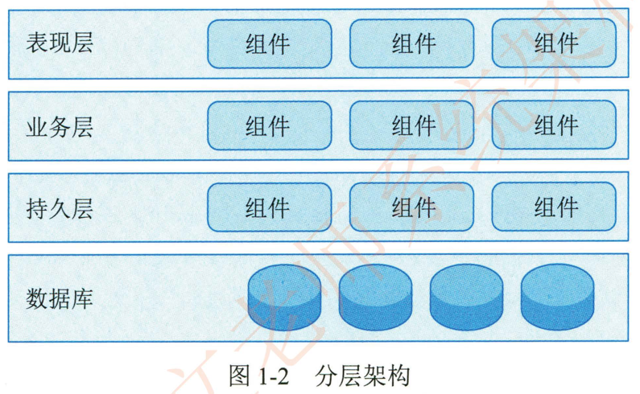
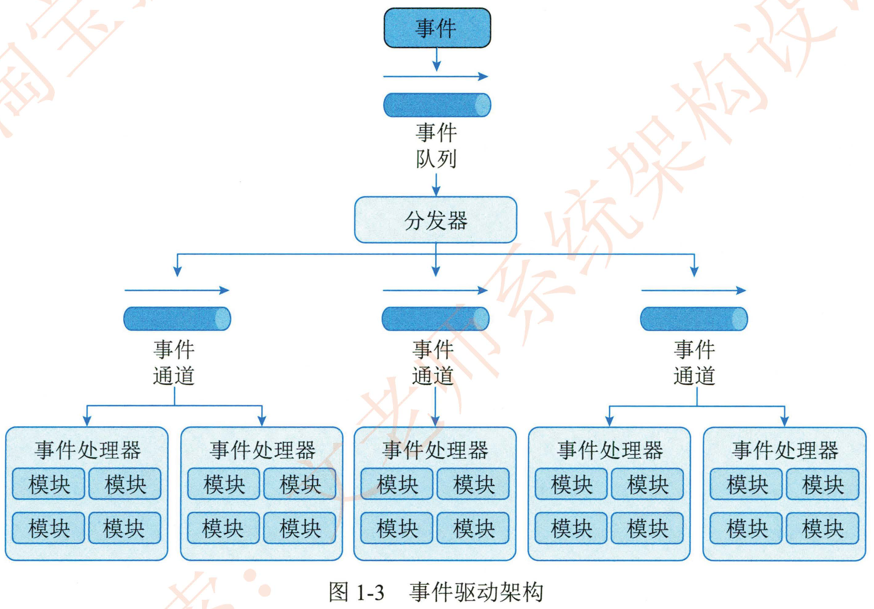
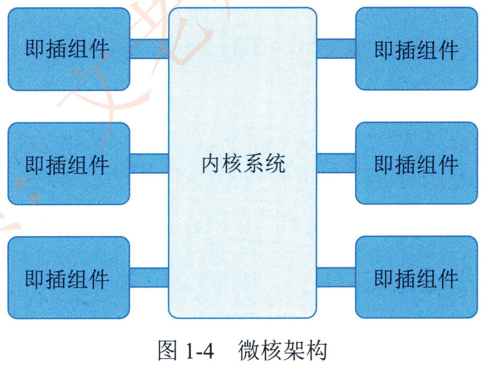
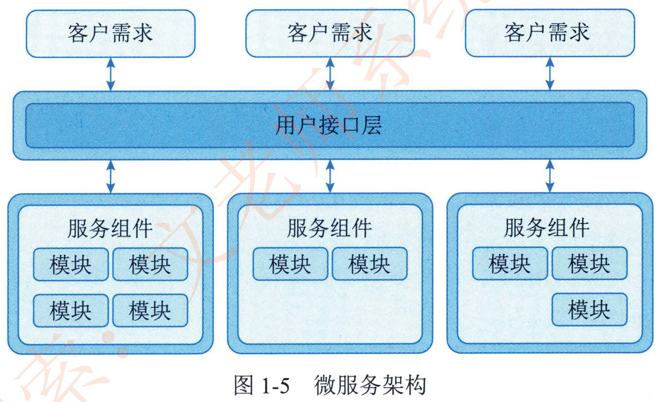
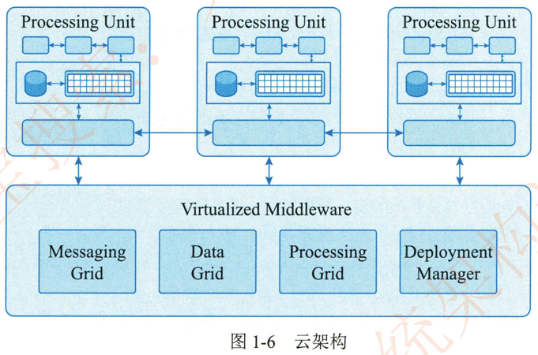

# 1.1.2软件架构的常用分类及建模方法 

## 1.软件架构的常用分类

多年来，“架构”概念经过不断演化，目前己形成了满足不同用途的架构模式，比较典型的架构模型包括分层架构。事件驱动架构微核架构。微服务架构和云架构等五类。当然。像 **C/S**、B/S， **管道-过滤器**和 **PAC** 等架构也是被广泛使用的软件架构，本节简要说明典型架构内涵

### 1 ）分层架构

分层架构 （Layered Architecture ）是最常见的软件架构，也是事实上的标准架构。这种架构将软件分成若干个水平层，每一层都有清晰的角色和分工，不需要知道其他层的细节=层与层之间通过接口进行通信。分层架构通常明确约定软件一定要分成多少层，但是，最常见的是四层结构，如图1-2所示

- 表现层（Presentation Layer）：用户界面，负责视觉和用户互动；

- 业务层（Business Layer）：实现业务逻辑；
- 持久层（Persistence Layer）提供数据，SQL语句就放在这一层；
- 数据库（Database Layer ）保存数据

表现层组件组件组件业务层组件组件组件持久层组件组件组件数据库图1-2分层架构

有的项目在逻辑层和持久层之间加了一个服务层 （Service）， 提供不同业务逻辑需要的一些通用接口用户的请求将依次通过这四层的处理，不能跳过其中任何一层。

### 2）事件驱动架构

事件 （Event） 是状态发生娈化时软件发出的通知。事件驱动架构 （Event-driven Architecture）是通过事件进行通信的软件架构，它分成四个部分，如图1-3  所示。

- 事件队列（Event Queue）：接收事件的入口；
- 分发器（Event Mediator）：将不同的事件分发到不同的业务逻辑单元；
- 事件通道（Event Channel）：分发器与处理器之间的联系渠道；

- 事件处理器 （Event Processor）： 二实现业务逻辑，处理完成后会发出事件，触发下一步操作。

对于简单的项目，事件队列、分发器和事件通逍可以合为一体。整个软件就分成事件代理和事件处理器两部分。

### 3 ）微核架构

微核架构 （Microkernel Architecture） 又称为插件架构 （Plug-in Architecture），是指软件的内核相对较小，主要功能和业务逻辑都通过插件实现，如图1-4所示。

内核 （Core） 通常只包含系统运行的最小功能=插件则是互相独立的，插件之间的通信应该减少到最低，避免出现互相依赖的问题。

### 4）徽服务架构

微服务架构（Microservices Architecture） 是服务导向架构（Service-Oriented Architecture， SOA）的升级。每一个服务就是一个独立的部署单元 （Separately Deployed Unit）这些单元都是分布式的。互相解耦。通过远程通信协议 （比如 REST  SOAP） 联系，如图 1-5 所示。

微服务架构分成三种实现模式。

- RESTful API模式：  服务通过API提供，云服务就属于这一类；

- RESTful 应用模式：  服务通过传统的网络协议或者应用协议提供，背后通常是一个多功能的应用程序。常见于企业内部；

- 集中消息模式：  采用消息代理 （Message Broker ） 可以实现消息队列负载均衡。统一日志和异常处理， 缺点是会出现单点失败，消息代理可能要做成集群。

### 5）云架构

云架构 （Cloud Architecture） 主要解决扩展性和并发的问题，是最容易扩展的架构

它的高扩展性体现在将数据都复制到内存中，变成可复制的内存数据单元，然后将业务处理能力封装成一个个处理单元 （Processing Unit）若访问量增加，就新建处理单元；  若访问量减少，就关闭处理单元。由于没有中央数据库，所以扩展性的最大瓶颈消失了。由于每个处理单元的数据都在内存里，需要进行数据持久化。

云架构主要分成两部分：  处理单元 （Processing Unit） 和虚拟中间件 （Virtualized Middleware）如图1-6所示。

**（1）** 处理单元：  实现业务逻辑。

**（2）**虚拟中间件：  负责通信、保持会话控制（sessions）， 数据复制、分布式处理和处理单元的部署。

这里，虚拟中间件又包含四个组件：

- 消息中间件 （Messaging Grid）：管理用户请求和会话控制（sessions）当一个请求进来以后。它决定分配给哪一个处理单元。

- 数据中间件 （Data Grid）：将数据复制到每一个处理单元。即数据同步。保证某个处理单元都得到同样的数据。

- 处理中间件 （Processing Grid）：可选，如果一个请求涉及不同类型的处理单元。该中间件负责协调处理单元。

- 部署中间件 （Deployment Manager）：负责处理单元的启动和关闭，监控负载和响应时间，当负载增加，就新启动处理单元，负载减少，就关闭处理单元。

## 2.系统架构的常用建模方法

架构师在进行软件架构设计时，必须掌握软件架构的表示方法，即如何对软件架构建模。根据建模的侧重点的不同。可以将软件架构的模型分成4种：结构模型、框架模型、动态模型和过程模型。

- 结构模型：  这是一个最直观、最普遍的建模方法。此方法以架构的构件、连接件和其他概念来刻画结构。并力图通过结构来反映系统的重要语义内容，包括系统的配置、约束、隐含的假设条件、风格和性质。研究结构模型的核心是架构描述语言。

- 框架模型：  框架模型与结构模型类似，但它不太侧重描述结构的细节，而更侧重整体的结构。框架模型主要以一些特殊的问题为目标建立只针对和适应问题的结构

- 动态模型：  动态模型是对结构或框架模型的补充， 主要研究系统的“大颗粒” 行为的性质。例如，描述系统的重新配置或演化。这里的动态可以是指系统总体结构的配置 建立或拆除通信或计算的过程，这类系统模型常是激励型的

- 过程模型：  过程模型是研究构造系统的步骤和过程，其结构是遵循某些过程脚本的结果。

上述介绍的4种模型并不是完全独立的，通过有机的结合才可形成一个完整的模型来刻画软件架构。也将能更加准确。全面地反映软件架构。软件架构可从不同角度来描述用户所关心架构的特征。Philippe Kruchten 在 1995年提出了一个“4+1” 视角模型。“4+1”模型从5个不同的视角包括逻辑 （Logical） 视角、过程 （Process） 视角、物理 （Physical） 视角、开发（Development）视角和场景 （Scenarios） 视角来描述软件架构。每一个视角只关心系统的一个侧面，5个视角结合在一起才能够反映系统的软件架构的全部内容。