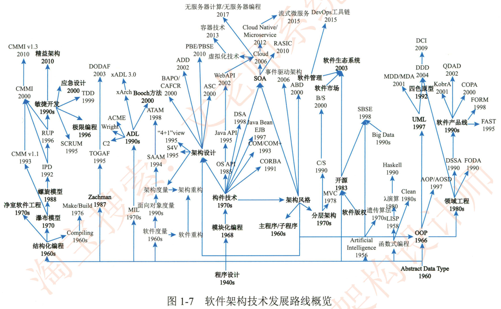

# 1.1.4软件架构的发展未来

从20世纪 40年代出现编程算法算起，软件架构及相关技术经历了70余年的发展，其中关键的技术如图1-7所示。架构发展的主线可以归纳为模块化编程/面向对象编程。构件技术。面向服务开发技术和云技术。这些阶段一方面引起了软件开发方法的演娈。另一方面引发了领域工程相关技术的广泛应用=针对架构本身的描述，建模和验证技术也在其中扮演着至关重要的角色。

从软件架构的发展历程可知，任何新技术。新方向和新思想的出现都会融入软件架构的发展历程中，如微服务架构。数据驱动架构以及智能架构等。随着人类认识能力的增强，在不远的将来，一定会出现更具价值的新型软件架构来指引相应的软件开发工作。

