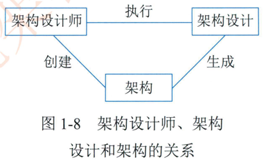

# 1.2.1架构设计师的定义、职责和任务

## 1架构设计师的定义

在定义架构设计师之前，先了解一下架构设计师、架构设计与架构之间的关系。如图1-8所示。

架构设计师是系统开发的主体角色。他们通过执行一系列活动来实施架构设计。架构设计通过生成过程形成最终的产品架构，架构设计师的成果是创建架构。从图1-8可以看出，  系统开发中架构设计师是整个系统的核心。

架构设计师是负责系统架构的人、团队或组织（IEE1471-2000）。架构设计师是系统或产品线的设计责任人，是一个负责理解和管理并最终确认和评估非功能性系统需求 （如软件的可维护性、性能、复用性、可靠性、有效性和可测试性等），给出开发规范。搭建系统实现的核心构架。对整个软件架构。关键构件和接口进行总体设计并澄清关键技术细节的高级技术人员。

# 2.架构设计师的职责

架构设计师的职责应该是技术领导，这意味着架构设计师除了拥有专门技能外，还必须拥有领导能力。首先，领导能力既体现在组织中的职位上，也体现在架构设计师展现的品质上。在组织中的职位方面。架构设计师是项目中的技术领导，应该拥有进行技术决策的权威。项目经理更关注管理资源。进度和成本方面的项目计划，架构设计师和项目经理代表了这个项目的公共角色。在架构设计师展现的品质方面。领导力也可以在与其他团队成员的交流中展现出来，架构设计师应该为他入树立榜样并在制定方向方面表现出自信成功的架构设计师是以人为导向的，都应在指导并培养他们团队的成员上花时间，以保证团队成员能够在后续项目的开发中能够完整地理解架构设计师的设计思路。其次，拥有专门技能主要体现在除了必须非常清楚项目的总体目标和实施方法外，还应是特定的开发平台 语言工具的大师，对常见应用场景能及时给出最恰当的解决方案，同时要对所属的开发团队有足够的了解。能够评估该开发团队实现特定的功能需求目标的资源代价。架构设计师必须非常关注交付的实际结果。并必须赋予项目在技术方面的驱动力，还必须能够进行决策并确保这些决策被传达、理解并始终被执行。

# 3.架构设计师的任务与组成

架构设计师在项目中的主要任务可概述如下。

**（1）** 领导与协调整个项目中的技术活动 （分析。设计和实施等）

**（2）**推动主要的技术决策并最终表达为系统架构。

**（3）**确定系统架构，并促使其架构设计的文档化。这里的文档化应包括需求设计。实施和部署等 "视图"。

从技术角度看，架构设计师的职责就是抽象设计。非功能设计和关键技术设计等三大任务。

架构设计师角色可以由一个人或一个团队来履行。在角色和人之间是存在差异的，如一个人可能会履行多个角色。由于架构设计师需要非常广泛的技能，所以架构设计师角色通常由多个人履行。这种方式允许技能分布于多个人，每个人都能充分运用他自己的经验特别是在理解业务领域和掌握各个方面技术所必须的技能上，往往由几个人才能很好地覆盖。

这个团队是拥有共同目标和执行目标，拥有使他们可以相互负责的方法，同时技能相互补充的一小部分人。

如果架构设计师角色由一个团队履行，拥有一个首席架构设计师角色非常重要，他不仅具有先知先明的能力  还是架构团队的单点协调人。没有这个协调人，架构团队的成员要创造出内聚的架构或做出决策是困难的。

优秀的架构设计师应知道他的优势和弱势 。无论架构设计师的角色是否由一个团队来履行，架构设计师都应有好几个可信顾问的支持，这样架构设计师不仅可以了解其弱点，还可以通过获取必要的技能或与他入一起合作来弥补其知识的缺陷。进而弥补这些弱点。最优秀的架构通常由一个团队而不是个人创建。这仅仅因为当有多人参与进来时 ，使见识更广和更深。