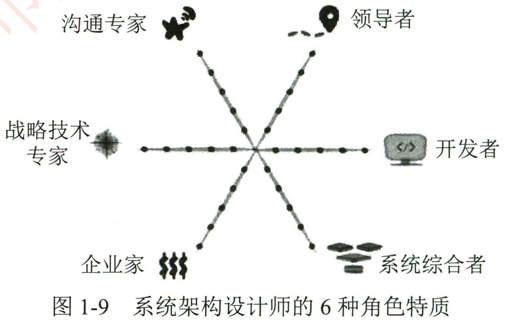

# 1.3.1如何衡量一名优秀架构设计师

对于系统架构设计师而言， 其优劣无法用统一的标准去衡量， 优秀与否实际上是相对的，但是。根据架构设计师的能力可以进行评价。架构设计师是一个充满挑战的职业。 需要关注很多维度和技术。Pat Kua （ 原Though Works 咨询师） 提出： 一个好的架构设计师是技术全面的，并给出了成为一个技术全面的架构设计师必须具备的6个角色特质 （见图1-9）。

- 作为领导者；
- 作为开发者；
- 作为系统综合者；
- 具备企业家思维；
- 具备战略技术专家的权衡思维与战术思维；
- 具备良好的沟通能力

## 1.作为技术领导者

一名好的软件架构设计师需要明自，作为领导者并不一定要告诉开发入员做什么。相反，好的架构设计师就像一个导师，能够带领开发团队向同一个技术愿景前进。好的架构设计师会借助讲故事。影响力 引导冲突和构建信任等领导技能。将他们的架构愿景娈成现实。一个好的领导者，同时也是一个好的架构设计师。他/她会仔细听取每个参与者的意见，通过与团队的互动调整他们的愿景。

## 2.作为开发人员

一个架构设计师同时又是一个好的开发人员。通常，做出一个良好的架构选择需要权衡理想的架构状态与软件系统的当前状态。例如，如果一个问题更适合采用关系型数据库来解决，那么将文档数据库引入到系统中的做法是毫无逍理的一个架构设计师如果不考虑技术选型与问题域之间的匹配度。会很容易受到各种技术的诱惑一一这也就是常见的 "象牙塔式架构设计师"行为模式。缓解这种情况的最佳方法是让架构设计师多与开发入员待在一起。花一些时间在代码上。了解系统的构建方式及系统的约束，这将帮助架构设计师在当下环境中做出正确的选择。

## 3.聚焦系统

经验丰富的开发人员明白代码只是软件的一部分<为了让代码可运行，他们还需要了解代码在生产环境中运行良好所需的其他重要质量属性。他们需要考虑部署过程自动化测试。性能。安全和可支持性等多个方面。开发入员可能以临时的方式来实现这些质量属性，而架构设计师不仅需要专注于了解代码，还要了解并满足不同利益相关者 （如支持。安全和运营人员 ）的需求。一个好的架构设计师需要专注于寻找那些能够满足不同利益相关者需求的解决方案，而不是选择针对某一个参与者的偏好或风格进行优化的工具或方法

## 4.具备企业家思维

所有技术选型都有相关的成本和收益，一个好的架构设计师需要从这两个角度考虑新的技术选型，就如成功的企业家是愿意承担风险的，他不但会寻求快速学习的机会和方法，也要学会做好接受失败的心理准备架构设计师可以用类似的方式做出技术选型，收集真实世界中有关短期和长期成本的信息，以及他们可能意识到的好处。

这方面一个很好的例子是，架构设计师避免承诺立即使用一个在阅读新文章时看到或在某一会议上听到过的工具。相反。他们试图通过架构调研来了解工具在其环境中的相关性，以收集更多信息。他们对于工具的选择不是基于销售量，而是考虑他们需要什么以及这个工具所提供的价值。他们还会寻找这些工具背后的隐性成本。例如工具的支持情况 （如文档化程度。社区使用情况） ，工具可能带来的约束或长期来看可能带来的额外风险。

## 5.权衡策略思维与战术思维

许多团队由一些独立的开发入员一起构建软件，而每个人都倾向于选择自己最舒适或最有经验的工具和技术。好的架构设计师会持续关注可能有用的新技术工具或方法。但不一定立即采用它们。技术采用往往需要长期的考量。架构设计师将在团队和组织层面寻求敏捷度 （允许团队快速采取行动）和一致性 （保持足够的一致性）之间的良好平衡~建立自己的技术雷达进行练习是用战略思维探索技术的一个有用工具。

## 6.良好的沟通

架构设计师需要知逍，有效的沟通是建立信任和影响团队以外成员的关键技能。他们知逍不同群体使用不同的术语。而使用技术术语的描述语言与业务入员沟通将会娈得比较困难。与其谈论模式。工具和编程概念，架构设计师需要使用听众熟悉的术语与之交流。诸如风险回报，成本和收益等。这比单纯使用技术词汇进行沟通来得更好。架构设计师还需要认识到团队内部沟通与外部沟通同样重要，可以使用图表和小组讨论的方式来建立和完善技术愿景。并进行书面记录 （如架构决策日志或 Wiki 等） ，从而为将来留下可追溯的历史。

总之，做一个技术全面的架构设计师并不容易，因为有很多方面需要关注，而每个方面都有很多作为开发人员经常不会专注并练习的技能。其实最重要的不一定是一个架构设计师的能力而是他们在每个不同的领域都有足够的专业知识。有价值的架构设计师需要在上述6个方面都具备良好的专业知识。