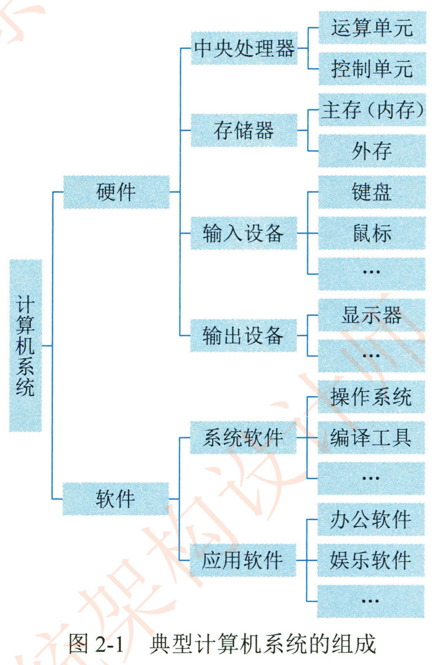
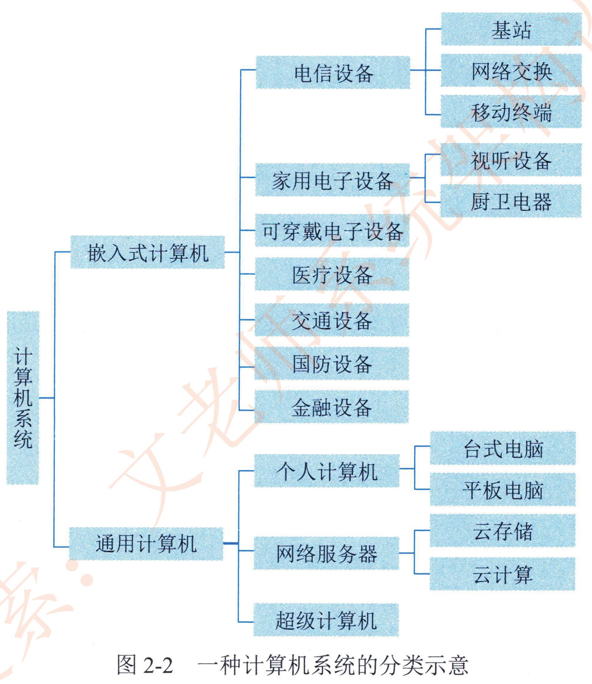

# 2.1计算机系统概述

计算机系统 （Computer System） 是指用于数据管理的计算机硬件。软件及网络组成的系统。它是按人的要求接收和存储信息，自动进行数据处理和计算，并输出结果信息的机器系统。人们在谈及计算机系统时， 一般指由硬件子系统和软件子系统组成的系统，简称为计算机。而将连接多个计算机以实现计算机间数据交换能力的网络设备。则称之为计算机网络。简称网络。

计算机系统可划分为硬件 （子系统）和软件 （子系统）两部分。硬件由机械、电子元器件。磁介质和r光介质等物理实体构成。例如处理器 （含运算单元和控制单元）、存储器、输入设备和输出设备等。软件是一系列按照特定顺序组织的数据和指令，并控制硬件完成指定的功能。可将计算机软件进一步分为系统软件和应用软件，系统软件是指支持应用软件的运行，为用户开发应用软件提供平台支撑的软件，而应用软件是指计算机用户利用计算机的软。硬件资源为某一专门的应用目的而开发的软件。典型的计算机系统组成如图2-1所示。

从存在形式上看，计算机硬件是有形的，而软件是无形的；  从计算机功能来看 ，硬件与软件的界限正在逐渐模糊。在不同的应用场合，基于设计考虑，某些功能可能由硬件实现，也可能由软件实现。比如，较典型的可编程逻辑。它在设计阶段可作为软件对待，但运行中则是以逻辑门的物理形态而存在。随着科技的发展，计算机系统的组成越来越复杂，多功能设备越来越多。

计算机系统的分类维度很多，也较为复杂，可以从硬件的结构。性能。规模上划分，亦可从软件的构成。特征上划分，或者从系统的整体用途。服务对象等进行分类。这里结合计算机系统的构成特征。应用领域和用途等描述一种常见分类。如图2-2所示。

由于篇幅限制，在图2-2所示的分类中。各结点的具体内容此处不再一一列举说明。由于技术的交叉和融合， 同一设备可以具有多种特征，可以归属于不同的父分类。如电话手表具备通信功能的平板电脑具备路由功能的电视盒等，故该分类并没有严格的界限，仅能够从主体功能进行大致分类。