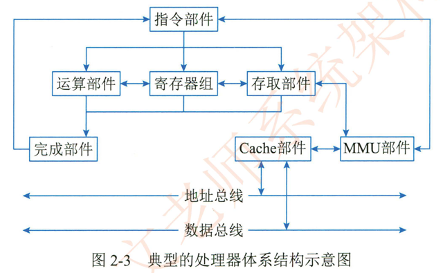

# 2.2.2处理器

处理器 （Central Processing Unit，CPU） 作为计算机系统运算和控制的核心部件，经历了长期演化过程。在位宽上由 4位处理器发展到  64 位处理器；  在能力构成上从仅具有运算和控制功能发展到集成多级缓存。多种通信总线和接口；  在内核上从单核处理器发展为多核。异构多核和众核处理器等。

处理器的指令集按照其复杂程度可分为复杂指令集 （Complex Instruction Set Computers，CISC） 与精简指令集 （Reduced Instruction Set Computers，RISC） 两类。CISC 以 Intel ，AMD的 X8GCPU 为代表，RISC 以 ARM 和 Power 为代表。随着研究的深入，除了由于历史原因而仍然存在的 CISC 结构外，RISC 已经成为计算机指令集发展的趋势， 几乎所有后期出现的指令集均为 RISC 架构。

典型的处理器系统结构如图2-3所示。

在图2-3中，指令部件通过 MMU-Cache 的存储结构，从内存等存储设备中取得相应的软件代码指令并完成译码和控制操作，控制存取部件从存储设备中取得新的数据，控制寄存器组为运算器淮备有关寄存器数据，并准备好结果寄存器，控制整型。浮点。向量等运算部件开展运算。运算部件 寄存器单元。存取部件将执行结果通知完成部件，并在完成部件中完成结果的排队，由完成部件向指令部件反馈执行结果。控制指令的顺序执行、跳转等时序。

随着微电子技术发展，用于专用目的处理器芯片不断涌现，常见的有图形处理器 （GraphicsProcessing Unit，GPU） 处理器信号处理器 （Digital Signal Processor，DSP） 以及现场可编程逻辑门阵列 （Field Programmable GateFPGA） 等GPU 是一种特殊类型的处理器，具有数百或数干个内核，经过优化可并行运行大量计算，因此近些年在深度学习和机器学习领域得到了广泛应用_DSP 专用于实时的数字信号处理，通过采用饱和算法处理溢出问题，通过乘积累加运算提高矩阵运算的效率。以及为傅里叶娈换设计专用指令等方法。在各类高速信号采集的设备中得到广泛应用。

随着我国国家政策的日益完善，国产处理器也呈现百花齐放的局面。在市场上占有率和知名度较高的包括龙芯。飞腾。申威。兆芯。国微。国芯华睿。翔腾微和景嘉微等产品。各自在不同的行业领域中得到应用。