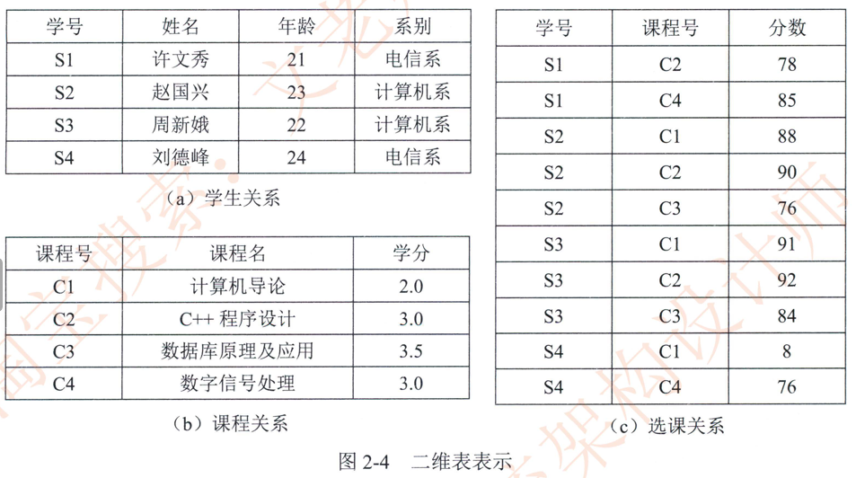
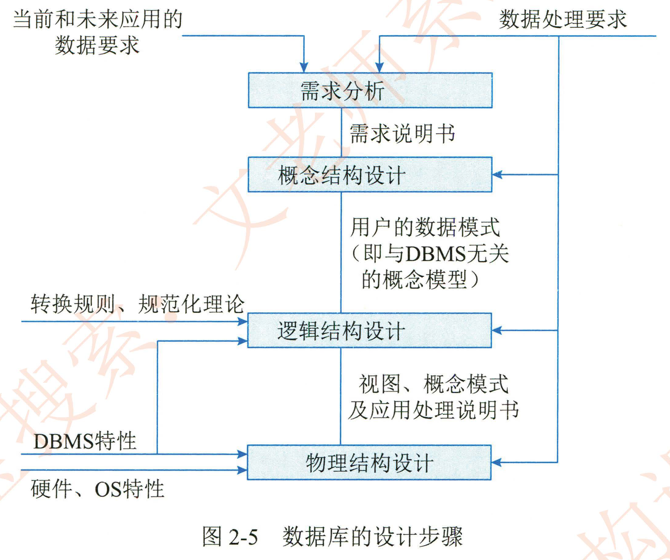
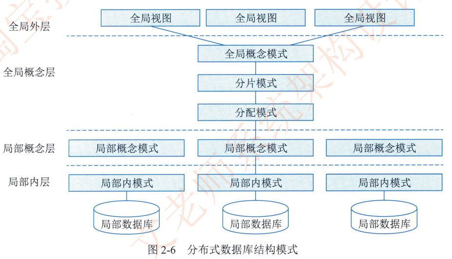

# 2.3.3数据库

在信息处理领域。由于数据量庞大。如何有效组织。存储数据对实现高效率的信息处理至关重要。数据库技术是目前最有效的数据管理技术。数据库 （DataBase，DB） 是指长期存储在计算机内。有组织的。统一管理的相关数据的集合。它不仅描述事物的数据本身，而且还包括相关事物之间的联系。数据库可以直观地理解为存放数据的仓库，只不过这个仓库是在计算机的存储设备上。而且数据是按一定格式存放的。具有较小的冗余度。较高的数据独立性和易扩展性。可为多个用户共享。

早期数据库种类有3种，分别是层次式数据库网络式数据库和关系型数据库。目前最常见的数据库种类是关系型数据库和非关系型数据库。根据数据库存储体系分类。还可分为关系型数据库。键值 （Key-Value） 数据库。列存储数据库文档数据库和搜索引擎数据库等类型。

**（1）关系型数据库**。这种类型的数据库是最传统的数据库类型。关系型数据库模型是把复杂的数据结构归结为简单的二元关系，在数据库中，对数据的操作几乎全部建立在一个或多个关系表格上。在大型系统中通常有多个表，且表之间有各种关系。实际使用就是通过对这些关联的表格进行分类。合并。连接或选取等运算来实现数据库的管理。

**（2）键值数据库**。键值数据库是一种非关系型数据库，它使用简单的键值方法来存储数据。键值数据库将数据存储为键值对集合，其中键作为唯一标识符。

**（3）列存储数据库**。列式存储 （Column-Based） 是相对于传统关系型数据库的行式存储（Row-Basedstorage） 来说的简单来说两者的区别就是对表中数据的存储形式的差异。

**（4）文档数据库**。此类数据库可存放并获取文档，可以是 XML 、JSON、BSON 等格式。这些文档具备可述性 （SelfDescribing） ， 呈现分层的树状结构 （Hierarchical Tree Data Structure） ，可以包含映射表集合和纯量值。数据库中的文档彼此相似，但不必完全相同。文档数据库所存放的文档，就相当于键值数据库所存放的 "值"文档数据库可视为其值可查的键值数据库。

**（5）搜索引擎数据库**。搜索引擎数据库是应用在搜索引擎领域的数据存储形式，由于搜索引擎会爬取大量的数据，并以特定的格式进行存储，这样在检索的时候才能保证性能最优。

下面简要介绍常用的关系数据库和分布式数据库。

## 1.关系数据库

数据模型是数据特征的抽象。它是对数据库组织方式的一种模型化表示，是数据库系统的核心与基础。它具有数据结构。数据操作和完整性约束条件三要素。

关系可以理解为二维表。一个关系模型就是指用若千关系表示实体及其联系，用二维表的形式存储数据。例如，对某高校学生的选课 （不同年级甚至同一年级学生所选课程可以不同）进行管理。可以用二维表表示，如图2-4所示。

关系表示如下，其中带下画线的属性为主码，主码能唯一确定某个实体。如学号能唯一确定某个学生。

学生（<u>学号</u>，姓名，年龄，系别）

课程 （<u>课程号</u>，课程名，学分）

选课（<u>学号</u>，<u>课程号</u>，分数）

### 1）关系数据库设计的特点及方法

数据库设计是指对于一个给定的应用环境构造最优的数据库，建立数据库及其应用系统，使之能有效地存储数据，满足各种用户的需求。数据库设计包括结构特性和行为特性的设计两方面的内容。

数据库设计的很多阶段都可以和软件工程的各阶段对应起来，数据库设计的特点有：  从数据结构即数据模型开始，并以数据模型为核心展开，这是数据库设计的一个主要特点；  静态结构设计与动态行为设计分离； 试探性；  反复性和多步性。

目前己有的数据库设计方法可分为4类。即直观设计法。规范设计法。计算机辅助设计法

和自动化设计法。常用的有基于 3NF 的设计方法基于实体联系〈E-R）模型的数据库设计方法。基于视图概念的数据库设计方法面向对象的关系数据库设计方法计算机辅助数据库设计方法。敏捷数据库设计方法等。

### 2）关系数据库设计的基本步骤

数据库设计分为需求分析、概念结构设计、逻辑结构设计、物理结构设计、应用程序设计和运行维护  6个阶段。如图2-5 所示。

需求分析阶段的任务是对现实世界要处理的对象（组织。部门和企业等） 进行详细调查，在了解现行系统的概况和确定新系统功能的过程中。收集支持系统目标的基础数据及其处理方法。需求分析是在用户调查的基础上，通过分析逐步明确用户对系统的需求，包括数据需求和围绕这些数据的业务处理需求。

数据库概念结构设计是在需求分析的基础上，依照需求分析中的信息需求。对用户信息加以分类 聚集和概括，建立信息模型，并依照选定的数据库管理系统软件，把它们转换为数据的逻辑结构。再依照软硬件环境。最终实现数据的合理存储。这一过程也称为数据建模。

设计数据库概念模型的最著名。最常用的方法是 E-R 方法。采用 E-R 方法的数据库概念结构设计可分为三步：  设计局部E-R模型、设计全局 E-R 模型以及全局 E-R模型的优化。

逻辑结构设计是在概念结构设计基础上进行的数据模型设计，可以是层次网状模型和关系模型。逻辑结构设计阶段的主要任务是确定数据模型。将E-R图转换为指定的数据模型。确定完整性约束。确定用户视图。

数据库在物理设备上的存储结构与存取方法称为数据库的物理结构。数据库的物理结构设计是对己确定的数据库逻辑结构，利用 DBMS 所提供的方法。技术，以较优的存储结构和数据存取路径合理的数据存放位置以及存储分配。设计出一个高效的可实现的数据库物理结构。

数据库应用系统开发是 DBMS 的二次开发， 一方面是对用户信息的存储； 另一方面就是对

用户处理要求的实现。

数据库应用程序设计要做的工作有选择设计方法。制订开发计划选择系统架构和设计安全性策略。在应用程序设计阶段。设计方法有结构化设计方法和面向对象设计方法两种。安全性策略主要是指硬件平台  操作系统。数据库系统。网络及应用系统的安全。

数据库的正常运行和优化也是数据库设计的内容之一。在数据库运行维护阶段要做的工作主要有数据库的转储和恢复，数据库的安全性和完整性控制，数据库性能的监督分析和改造，数据库的重组和重构等。

## 2.分布式数据库

分布式数据库系统 （Distributed DataBase System，DDBS ） 是针对地理上分散，而管理上又需要不同程度集中管理的需求而提出的种数据管理信息系统。满足分布性逻辑相关性。场地透明性和场地自治性的数据库系统被称为完全分布式数据库系统。

分布式数据库系统的特点是数据的集中控制性、数据独立性、数据冗余可控性、场地自治性和存取的有效性

### 1 ）分布式数据库体系结构

我国在多年研究与开发分布式数据库及制定《分布式数据库系统标淮》中，提出了把分布式数据库抽象为4层的结构模式。如图2-6所示。这种结构模式得到了国内外一定程度的支持和认同。

4层模式划分为全局外层、全局概念层、局部概念层和局部内层，在各层间还有相应的层间映射。这种 4层模式适用于同构型分布式数据库系统。也适用于异构型分布式数据库系统。

### 2 ）分布式数据库的应用

分布式数据库的应用领域有分布式计算、Internet 应用、数据仓库、数据复制以及全球联网查询等，Sybase 公司的 Replication Server 即是一种典型的分布式数据库系统。

## 3.常用数据库管理系统

计算机科学技术不断发展，数据库管理系统也不断发展进化， MySQL AB 公司 （2009年被Oracle 公司收购） 的 MySQL`Microsoft 公司的 Access 等是小型关系数据库管理系统的代表，Oracle 公司的 Oracle，Microsoft 公司的 SQL ServerIBM 公司的 DB2 等是功能强大的大型关系数据库管理系统的代表。

### 1 ） Oracle

Oracle 是一种适用于大型中型和微型计算机的关系数据库管理系统。Oracle 的结构包括数据库的内部结构。外存储结构。内存储结构和进程结构。在 Oracle 中，数据库不仅指物理上的数据，还包括处理这些数据的程序，即 DBMS 本身。Oracle 使用 PLISQL（ProceduralLanguagelSQL ） 语言执行各种操作。 Oracle 除了以关系格式存储数据外，Oracle 8以上的版本还支持面向对象的结构 （如抽象数据类型）。

Oracle 产品主要包括数据库服务器开发工具和连接产品三类Oracle 还提供了一系列的工具产品，如逻辑备份工具 Export  Import 等。

### 2 ） IBM DB2

DB2 是 IBM 的一种分布式数据库解决方案。简单地说，DB2 就是 IBM 开发的一种大型关系型数据库平台，它支持多用户或应用程序在同一条 SQL 语句中查询不同 Database 甚至不同DBMS 中的数据 。

DB2 核心数据库的特色有支持面向对象编程，支持多媒体应用程序，支持备份和恢复功能，支持存储过程和触发器，支持 SQL 查询，支持异构分布式数据库访问，支持数据复制。

DB2 采用多进程多线索体系结构，可运行于多种操作系统之上~IBM 还提供了 Visualizer Visualage，Visualgen 等开发工具。

### 3 ） Sybase

Sybase 是美国 SYBASE 公司在20世纪 &0年代中期推出的客户机/服务器 （ClientlServer，CIS） 结构的关系数据库系统，也是世界上第一个真正的基于客户机/服务器结构的 RDBMS产品

Sybase 数据库主要由三部分组成：  进行数据库管理和维护的联机关系数据库管理系统Sybase SQLServer，支持数据库应用系统建立与开发的一组前端工具 Sybase SQLToolset，可把异构环境下其他厂商的应用软件和任何类型的数据连接在一起的接口 Sybase OpenClientlOpenServer。

Sybase 提供了 Sybase Adaptive Server Enterprise 高性能企业智能型关系数据库管理系统EAServer 电子商务解决方案应用服务器系统分析设计工具 PowerDesigner 和应用开发工具PowerBuilderc。

### 4 ） Microsoft SQL Server

Microsoft SQL Server 是-种典型的关系型数据库管理系统，可运行于多个操作系统上。它使用 Transact-SQL 语言完成数据操作。

SQL Server 的基本服务器组件包括 Open Data Services、MS SQL Server、SQL Server Agent和 MSDTC （Microsoft Distributed Transaction Coordinator）。

SQL Server 数据平台包括以下工具：  关系型数据库。复制服务通知服务集成服务。分析服务报表服务。管理工具和开发工具。

## 4.大型数据库管理系统的特点

大型数据库管理系统主要有如下7个特点。

1. 基于网络环境的数据库管理系统。可以用于 CIS 结构的数据库应用系统，也可以用于B/S 结构的数据库应用系统。

2. 支持大规模的应用可支持数千个并发用户。多达上百万的事务处理和超过数百 GB的数据容量。

3. 提供的自动锁功能使得并发用户可以安全而高效地访问数据
4. 可以保证系统的高度安全性。
5. 提供方便而灵活的数据备份和恢复方法及设备镜像功能，还可以利用操作系统提供容错功能，确保设计良好的应用中的数据在发生意外的情况下可以最大限度地被恢复。
6. 提供多种维护数据完整性的手段。
7. 提供了方便易用的分布式处理功能。