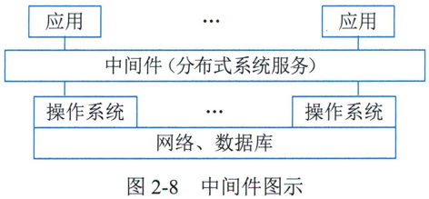

# 2.3.6中间件

由于应用软件是在系统软件基础上开发和运行的，而系统软件又有多种，如果每种应用软件都要提供能在不同系统上运行的版本，开发成本将大大增加=因而出现了一类称为 "中间件"（Middleware） 的软件。它们作为应用软件与各种操作系统之间使用的标准化编程接口和协议，可以起承上启下的作用，使应用软件的开发相对独立于计算机硬件和操作系统，并能在不同的系统上运行，实现相同的应用功能。中间件是基础软件的一大类。属于可复用软件的范畴。顾名思义。  中间件处在操作系统。网络和数据库之上，应用软件的下层。如图2-8所示。也有人认为中间图示件应该属于操作系统中的一部分。

## 1.中间件分类

按照中间件在分布式系统中承担的职责不同，可以划分以下几类中间件产品

### 1 ）通信处理（消息）中间件

正如，人们通过安装红绿灯，设立交通管理机构，制定出交通规则。才能保证逍路交通畅通一样，在分布式系统中 ，人们要建网和制定出通信协议。以保证系统能在不同平合之间通信，实现分布式系统中可靠的。高效的。实时的跨平台数据传输，  这类中间件称为消息中间件，也是市面上销售额最大的中间件产品。目前主要产品有 BEA 的 eLink、IBM 的 MQSeries、TongLINK 等。实际上， 一般的网络操作系统如 Windows 己包含了其部分功能。

### 2） 事务处理〈交易）中间件

正如城市交通中要运行各种运载汽车，以此来完成日常的运载工作。同时随时监视汽车的运行，在出现故障时及时排堵保畅。在分布式事务处理系统中，经常要处理大量事务。特别是OLIP 中，每项事务常常要多台服务器上的程序按顺序协调完成， 一旦中间发生某种故障，不但要完成恢复工作，而且要自动切换系统保证系统永不停机。实现高可靠性运行。要使大量事务在多台应用服务器上能实时并发运行，并进行负载平衡的调度。实现与昂贵的可靠性机和大型计算机系统的同等功能，为了实现这个目标。要求中间件系统具有监视和调度整个系统的功能<BEA 的 Tuxedo 由此而闻名，它成为增长率最高的厂商。

### 3 ）数据存取管理中间件

在分布式系统中，重要的数据都集中存放在数据服务器中，它们可以是关系型的。复合文档型具有各种存放格式的多媒体型，或者是经过加密或压缩存放的，该中间件将为在网络上虚拟缓冲存取。格式转换。解压等带来方便。

### 4 ） Web 服务器中间件

浏览器图形用户界面己成为公认规范。然而它的会话能力差不擅长做数据的写入任务，HTTP 协议的限制多等。就必须对其进行修改和扩充，因此出现了 Web 服务器中间件，如SilverStream 公司的产品。

### 5）安全中间件

一些军事、政府和商务部门上网的最大障碍是安全保密问题，而且不能使用国外提供的安全措施 （如防火墙。加密和认证等） ，必须用国产产品产生不安全因素是由操作系统引起的，但必须要用中间件去解决，以适应灵活多娈的要求。

### 6 ）跨平台和架构的中间件

当前开发大型应用软件通常采用基于架构和构件技术。在分布式系统中，还需要集成各结点上的不同系统平台上的构件或新老版本的构件，由此产生了架构中间件。功能最强的是CORBA，可以跨任意平台，但是其过于庞大； JavaBeans 较灵活简单，很适合用于浏览器。但运行效率有待改善； COMt 模型主要适合 Windows 平台，己在桌面系统广泛使用由于国内新建系统多基于 UNIX （ 包括 Linux） 和 Windows，因此。针对这两个平台建立相应的中间件市场相对要大得多。

### 7 ）专用平台中间件

专用平台中间件为特定应用领域设计领域参考模式。建立相应架构，配置相应的构件库和中间件，为应用服务器开发和运行特定领域的关键任务 （如电子商务网站等）。

### 8）网络中间件

它包括网管。接入，网络测试。虚拟社区和虚拟缓冲等，也是当前最热门的研发项目

## 2.中间件产品介绍

主流的中间件产品有 IBM MQSeries 和 BEA Tuxedo。

### 1 ） IBM MQSeries

IBM 公司的 MQSeries 是 IBM 的消息处理中间件MQSeries 提供一个具有工业标准。安全可靠的消息传输系统。它用于控制和管理一个集成的系统，使得组成这个系统的多个分支应用（模块）之间通过传递消息完成整个工作流程CMQSeries 基本由一个信息传输系统和一个应用程序接口组成。其资源是消息和队列。

MQSeries 的关键功能之一是确保信息的可靠传输，即使在网络通信不可靠或出现异常时也能保证信息的传输=MQSeries 的异步消息处理技术能够保证当网络或者通信应用程序本身处于“忙”状态或发生故障时=系统之间的信息不会丢失，也不会阻塞。这样的可靠性是非常关键的，否则大量的金钱和客户信誉就会面临极大的损害。

同时，MQSeries 是灵活的应用程序通信方案。MQSeries 支持所有的主要计算平台和通信模式；也能够支持先进的技术 （如 Internet 和 Java ） ， 拥有连接至主要产品 （如 LotusNotes 和SAP/R3 等）的接口

### 2 ） BEA Tuxedo

BEA 公司的 Tuxedo 作为电子商务交易平台，属于交易中间件。它允许客户机和服务器参与一个涉及多个数据库协调更新的交易，并能够确保数据的完整性BEA Tuxedo 一 个特色功能是能够保证对电子商务应用系统的不间断访问 <它可以对系统构件进行持续的监视，查看是否有应用系统，交易。网络及硬件的故障~一旦出现故障，BEA Tuxedo 会从逻辑上把故障构件排除，然后进行必要的恢复性步骤。

BEA Tuxedo 根据系统的负载指示。自动开启和关闭应用服务，可以均衡所有可用系统的负载，以满足对应用系统的高强度使用需求。借助 DDR（数据依赖路由） ，BEA Tuxedo 可按照消息的上下文来选择消息路由其交易队列功能，可使分布式应用系统以异步“少连接”方式协同工作。

BEA Tuxedo 的 LLE 安全机制可确保用户数据的保密性，应用/交易管理接口为50多种硬件平台和操作系统提供了一致的应用编程接口BEA Tuxedo 基于网络的图形界面管理可以简化对电子商务的管理，为建立和部署电子商务应用系统提供了端到端的电子商务交易平台。