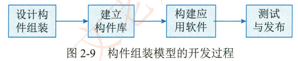

# 2.3.7软件构件

软件构件构件又称为组件。是一个自包容可复用的程序集。构件是一个程序集，或者说是一组程序的集合。这个集合可能会以各种方式体现出来，如源程序或二进制的代码。这个集合整体向外提供统一的访问接口，构件外部只能通过接口来访问构件，而不能直接操作构件的内部。构件的两个最重要的特性是自包容与可重用

## 1.软件构件的组装模型

随着软件构件技术的发展，人们开始尝试利用软件构件进行搭积木式的开发，即构件组装模型。在构件组装模型中，当经过需求分析定义出软件功能后，将对构件的组装结构进行设计，将系统划分成一组构件的集合，明确构件之间的关系。在确定了系统构件后，则将独立完成每一个构件，这肘既可以开发软件构件。也可以重用己有的构件，当然也可以购买或选用笫三方的构件。构件是独立的自包容的，因此架构的开发也是独立的，构件之间通过接口相互协作。

构件组装模型的一般开发过程如图2-9所示。

设计构建立构建应测试件组装构件库用软件与发布

构件组装模型的优点如下：  构件的自包容性让系统的扩展娈得更加容易；  设计良好的构件更容易被重用，降低软件开发成本； 构件的粒度较整个系统更小，因此安排开发任务更加灵活，可以将开发团队分成若干组。并行地独立开发构件

构件组装模型也有明显的缺点：  对构件的设计需要经验丰富的架构设计师，设计不良的构件难以实现构件的优点，降低构件组装模型的重用度；  在考虑软件的重用度时，往往会对其他方面做出让步，如性能等；  使用构件组装应用程序时，要求程序员能熟练地掌握构件，增加了研发人员的学习成本； 笫三方构件库的质量会最终影响到软件的质量，而第三方构件库的质量往往是开发团队难以控制的

## 2.商用构件的标准规范

当前，主流的商用构件标推规范包括对象管理组织 （Object ManagementOMG） 的CORBA`Sun 的 J2EE 和 Microsoft 的 DNA。

### 1 ） CORBA

公共对象请求代理架构（Common Object Request Broker Architecture，CORBA） 主要分为3个层次：  对象请求代理。公共对象服务和公共设施。最底层的对象请求代理 （Object RequestBroker，ORB ） 规定了分布对象的定义（接口）和语言映射，实现对象间的通信和互操作，是分布对象系统中的 "软总线"；在 ORB 之上定义了很多公共服务，可以提供诸如并发服务。名字服务。事务（交易）服务安全服务等各种各样的服务；  最上层的公共设施则定义了构件框架，提供可直接为业务对象使用的服务，规定业务对象有效协作所需的协定规则

CORBA CCM （CORBA Component Model ） 构件模型是 OMG 组织制定的一个用于开发和配置分布式应用的服务器端构件模型规范，它主要包括如下3项内容。

1. 抽象构件模型：用以描述服务器端构件结构及构件间互操作的结构

2. 构件容器结构：  用以提供通用的构件运行和管理环境，并支持对安全事务。持久状态等系统服务的集成。

3. 构件的配置和打包规范： CCM 使用打包技术来管理构件的二进制多语言版本的可执行代码和配置信息，并制定了构件包的具体内容和文档内容标准。

### 2 ） J2EE

在 J2EE 中， SUN 给出了完整的基于 Java 语言开发面向企业分布的应用规范。其中，在分布式互操作协议上， J2EE 同时支持远程方法调用（Remote Method Invocation，RMI） 和互联网内部对象请求代理协议 （Internet Inter-ORB Protocol，IOP）而在服务器端分布式应用的构造形式，则包括了 Java Servlet JSPEJB 等多种形式，以支持不同的业务需求。而且 Java 应用程序具有跨平台的特性，使得 J2EE 技术在发布计算领域得到了快速发展。其中， EJB 给出了系统的服务器端分布构件规范，这包括了构件构件容器的接口规范以及构件打包。构件配置等的标准规范内容。EJB 技术的推出，使得用 Java 基于构件方法开发服务器端分布式应用成为可能。从企业应用多层结构的角度， EJB 是业务逻辑层的中间件技术。与 JavaBeans 不同，它提供了事务处理的能力。自从三层结构提出以后。中间层 （也就是业务逻辑层）是处理事务的核心，从数据存储层分离。取代了存储层的大部分地位。从 Iteret 技术应用的角度， EJB，Servlet 和JSP 一起成为新一代应用服务器的技术标准。EJB 中的 Bean 可以分为会话 Bean 和实体 Bean，前者维护会话，后者处理事务。通常由 Servlet 负责与客户端通信，访问 EJB， 并把结果通过JSP 产生页面传回客户端

### 3 ） DNA 2000

Microsoft DNA 2000 是 Microsoft 在推出 Windows 2000 系列操作系统平台的基础上，在扩展了分布计算模型以及改造 BackOffice 系列服务器端分布计算产品后发布的新的分布计算架构和规范。在服务器端，DNA 2000 提供了 ASP，COMCluster 等的应用支持DNA 2000 融合了当今最先进的分布计算理论和思想，如事务处理可伸缩性异步消息队列和集群等内容。DNA 可以开发基于 Microsoft 平台的服务器构件应用，其中，如数据库事务服务。异步通信服务和安全服务等，都由底层的分布对象系统提供。

Microsoft 的 DCOM/COM/COM+ 技术在 DNA 2000 分布计算结构基础上，展现了一个全新的分布构件应用模型。首先，DCOM/COM/COM+ 的构件仍然采用普通的构件对象模型（Component Object Model，COM）COM 最初作为 Microsoft 桌面系统的构件技术，主要为本地的对象连接与嵌入 （Object Linking and Embedding，OLE） 应用服务。但是随着 Microsoft服务器操作系统 Windows NT 和分布式构件对象模型Distributed Component Object Model，DCOM） 的发布，COM 通过底层的远程支持使得构件技术延伸到了分布应用领域。DCOM/COM/COM+更将其扩充为面向服务器端分布应用的业务逻辑中间件。通过 COMt 的相关服务设施，如负载均衡。内存数据库。对象池。构件管理与配置等，DCOM/COM/COM+ 将 COMD、COM、MTS（Microsoft Transaction Server， 微软事物处理服务器）  的功能有机地统一在一起，形成了一个功能强大的构件应用架构。

通过购买商用构件并遵循其开发标准来进行应用开发。是提高应用软件开发效率的常见选择。