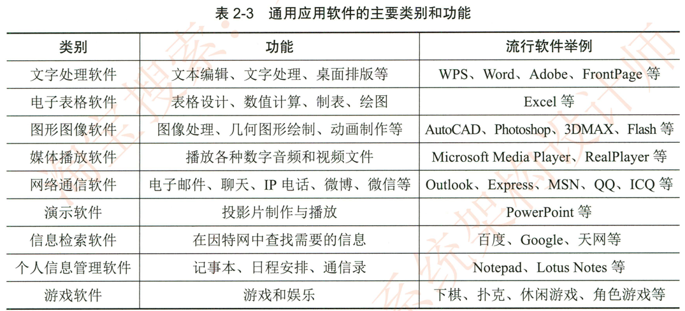

# 2.3.8应用软件

应用软件是为了利用计算机解决某类问题而设计的程序的集合，是为满足用户不同领域不同问题的应用需求而提供的软件。有些软件是为个人用户设计的，有些软件则是为企业应用设计的应用软件种类繁多，包括办公软件。图形图像。系统管理文件管理，邮件处理。学习娱乐即时通信。音频视频工具和浏览器等。

按照应用软件的开发方式和适用范围，应用软件可再分成通用应用软件和定制应用软件两大类。

## 1.通用软件

常见的通用软件分文字处理软件电子表格软件。媒体播放软件网络通信软件个人信息管理软件。演示软件绘图软件。信息检索软件和游戏软件等 （见表2-3）这些软件设计得很精巧，易学易用，在用户几乎不经培训就能普及到计算机应用的进程中，它们起到了很大的作用

表2-3通用应用软件的主要类别和功能

## 2.专用软件

专用软件是按照不同领域用户的特定应用要求而专门设计开发的。如超市的销售管理和市场预测系统。汽车制造厂的集成制造系统。大学教务管理系统医院信息管理系统酒店客房管理系统等。这类软件专用性强，设计和开发成本相对较高，主要是机构用户购买，因此价格比通用应用软件贵得多。

所有得到广泛使用的应用软件， 一般都具有以下的共同特点：  它们能替代现实世界己有的工具。而且使用起来比己有工具更方便。有效； 它们能完成己有工具很难完成甚至完全不可能完成的任务，扩展了人们的能力