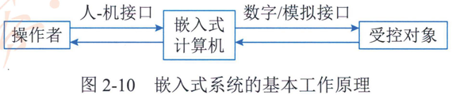

# 2.4.1嵌入式系统的组成及特点

嵌入式系统是以应用为中心 以计算机技术为基础，并将可配置与可裁减的软。硬件集成于一体的专用计算机系统，需要满足应用对功能可靠性。成本。体积和功耗等方面的严格要求。嵌入式系统通常通过外部接口采集相关输入信息或人机接口输入的命令，对输入数据进行加工和计算，并将计算结果通过外部接口输出，以控制受控对象，如图2-10所示。

从计算机角度看 ，嵌入式系统是指嵌入各种设备及应用产品内部的计算机系统。它主要完成信号控制的功能，体积小。结构紧凑，可作为一个部件埋藏于所控制的装置中它提供用户接口，管理有关信息的输入输出和设备监控工作，使设备及应用系统有较高智能和性价比。从技术角度看 ，嵌入式系统是计算机技术。通信技术。半导体技术。微电子技术。语音图像。数据传输技术。以及传感器等先进技术和具体应用对象相结合后的换代产品。是技术密集。投资规模大。高度分散。不断创新的知识密集型系'统。反映了当代最新技术的先进水平。从综合角度看，嵌入式系统定义为现代科学多学科相互融合的以应用技术产品为核心，以计算机技术为基础。以通信技术为载体，以消费类产品为对象，引入各类传感器，引入 Internet 网络技术的连接。从而适应应用环境的产品。

## 1.嵌入式系统的组成

一般嵌入式系统由嵌入式处理器相关支撑硬件。嵌入式操作系统。支撑软件以及应用软件组成。

1.  嵌入式处理器。由于嵌入式系统一般是在恶劣的环境条件下工作。与一般处理器相比，嵌入式处理器应可抵抗恶劣环境的影响，比如高温，寒冷。电磁加速度等环境因素。为适应恶劣环境。嵌入式处理器芯片除满足低功耗。体积小等需求外，根据不同环境需求。其工艺可分为民用。工业和军用等三个档次。

2. 相关支撑硬件。相关支撑硬件是指除嵌入式处理器以外的构成系统的其他硬件，包括存储器定时器总线 IO 接口以及相关专用硬件。基于 ARM 处理器的嵌入式计算机硬件组成图如图2-11所示，其中嵌入式 ARM 处理器是嵌入式计算机的核心部件，也是整个系统的运算中心。相关支撑硬件主要包括 4类：  存储器。输出设备。输入设备。接口和网络总线。本嵌入式存储器配备了非易失存储器 （Flash），内存（SDRAM），硬盘（非线性 Flash 盘），显示设备配备了 LCD 显示，输入设备配备了键盘设备。提供了RS-232串行接口USB 接口和 JTAG等三路 IO 接口。配备了 TCP/IP 网络和 CAN 总线。

3. 嵌入式操作系统。嵌入式操作系统是指运行在嵌入式系统中的基础软件主要用于管理计算机资源和应用软件。与通用操作系统不同。嵌入式操作系统应具备实时性可剪裁性和安全性等特征。

4. 支撑软件。支撑软件是指为应用软件开发与运行提供公共服务。软件开发。调试能力的软件，支撑软件的公共服务通常运行在操作系统之上。以库的方式被应用软件所引用。

5. 应用软件。应用软件是指为完成嵌入式系统的某一特定目标所开发的软件。

## 2.嵌入式系统的特点

根据嵌入式系统的应用背景及其在应用中所起作用，嵌入式系统应具备以下特性。

1. 专用性强。嵌入式系统面向特定应用需求，能够把通用 CPU 中许多由板卡完成的任务集成在芯片内部。从而有利于嵌入式系统的小型化。

2. 技术融合。嵌入式系统将先进的计算机技术。通信技术。半导体技术和电子技术与各个行业的具体应用相结合，是一个技术密集。资金密集高度分散。不断创新的知识集成系统。

3. 软硬一体软件为主。软件是嵌入式系统的主体。有卫核。嵌入式系统的硬件和软件都可以高效地设计 ，量体裁衣，去除冗余。可以在同样的硅片面积上实现更高的性能。

4. 比通用计算机资源少。由于嵌入式系统通常只完成少数几个任务。设计时考虑到其经济性，不能使用通用 CPU， 这就意味着管理的资源少，成本低。结构更简单。

5. 程序代码固化在非易失存储器中。为了提高执行速度和系统可靠性，嵌入式系统中的软件一般都固化在存储器芯片或单片机本身中，而不是存在磁盘中。

6. 需专门开发工具和环境。嵌入式系统本身不具备开发能力，即使设计完成以后。用户通常也不能对其中的程序功能进行修改，必须有一套开发工具和环境才能进行开发。

7. 体积小，价格低。工艺先进性能价格比高。系统配置要求低实时性强。

8. 对安全性和可靠性的要求高。