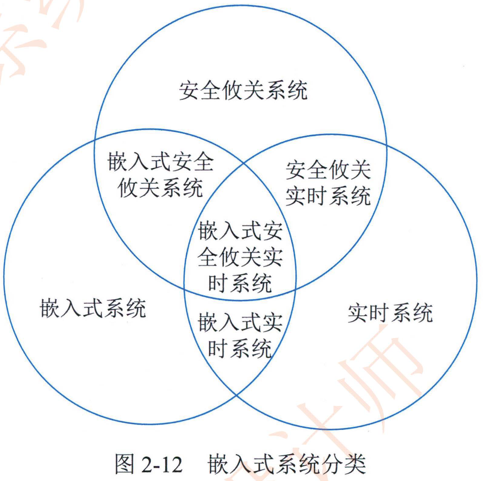

# 2.4.2嵌入式系统的分类

嵌人式系统的分类由于嵌入式系统是一个“深埋”于设备中，对设备的各种传感器进行管理与控制的系统。可从不同角度去划分嵌入式系统。通常，根据不同用途可将嵌入式系统划分为嵌入式实时系统和嵌入式非实时系统两种，而实时系统又可分为强实时 （Hard Real-Time） 系统和弱实时 （WeakReal-Time ） 系统。如果从安全性要求看，嵌入式系统还可分为安全攸关 （Safety-Critical 或 Life-时系统和非安全攸关系统。嵌入式系统的时系统分类如图2-12所示。

1.  实时系统 （Real-Time System，RTS）实时系统是指能够在指定或者确定的时间内完成系统功能和外部或内部。同步或异步时间做出响应的系统。也就是说。系统计算的正确性不仅取决于程序的逻辑正确性。也取决于结果产生的时间，如果系统的时间约束条件得不到满足。 将会发生系统错误。

2. 安全攸关系统 （Safety-Critical System）安全攸关系统也称为安全关键系统或者安全生命关键系统 （Life-Critical System） ， 是指其不正确的功能或者失效会导致人员伤亡。财产损失等严重后果的计算机系统