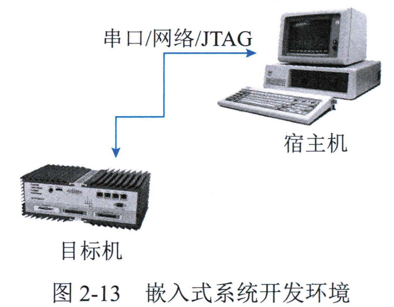
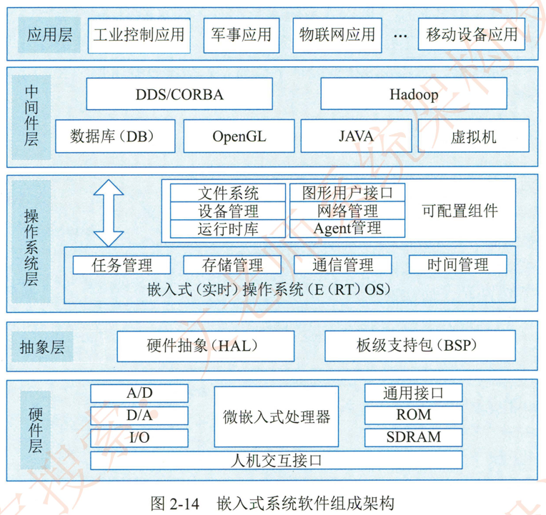

# 2.4.3嵌入式软件的组成及特点

嵌入式系统的最大特点就是系统的运行和开发是在不同环境中进行的，通常将运行环境称为 "目标机"环境。称开发环境为 宿主机" 环境。其结构如图2-13  所示。

在目标机环境运行时，系统与被控对象直接相关联，其系统架构的优劣也影响着被控对象功能的好坏下面所介绍的嵌入式系统通用架构主要指目标机环境架构

嵌入式系统的能力与应用需求密不可分，同时也与硬件配置存在着紧密的耦合性_通常，嵌入式系统软件组成架构宿主机采用层次化结构，并且具备可配置可剪裁能力-从现代嵌入式系统观看，人们把嵌入式系统分为硬件层、抽象层、操作系统层、中间件层和应用层等5层，如图2-14所示。

1. 硬件层硬件层

	主要是为嵌入式系统提供运行支撑的硬件环境，其核心是微处理器存储器（ROM SDRAM  Flash 等） I/O 接口（A/D、D/A、 I/O 等）和通用设备以及总线、电源、时钟等。
	
2. 抽象层

	在硬件层和软件层之间为抽象层，主要实现对硬件层的硬件进行抽象（Hardware Abstract Layer，HAL ） ， 为上层应用 （操作系'统） 提供虚拟的硬件资源；  板级支持包（Board Support Package，BSP ） 是一种硬件驱动软件，它是面向硬件层的硬件芯片或电路进行驱动，为上层操作系统提供对硬件进行管理的支持。

3. 操作系统层。

	操作系统层主要由嵌入式操作系统。文件系统。图形用户接口。网络系统和通用组件等可配置模块组成。嵌入式操作系统的功能主要包括任务管理：内部存储器管理任务间通信管理和时钟/中断管理等，主要完成系统的硬件资源。软件资源进行调度和管理；可配置组件是对操作系统的基本功能的扩展。为用户提供更加丰富的公共能力。这些组件具备可配置和可剪裁特性。用户可根据自己设计的应用系统需求。做适当组合通常可配置组件包括了文件系统。设备管理，运行时库 （RTL），图形用户接口 （GUI），网络管理 （如 TCP/IP）和支持系统软件调试用的目标机代理 （Agent） 等组件。

4. 中间件（Middleware） 层。

	中间件是指一种独立的系统软件或服务程序，分布式应用系统借助这种软件可在不同的技术之间共享资源。中间件层一般位于操作系统之上，管理计算机资源和网络通信。中间件层是连接两个独立应用的桥粱。通常，中间件可分为服务中间件集成中间件。数据中间件消息中间件和安全中间件等5类。在嵌入式系统中，比较常用的中间件产品有嵌入式数据库  OpenGr 图形图像处理软件JAVA 中间件虚拟机 （VM），DDS/CORBA 和 Hadoop 等。

5. 应用层。

	应用层是指嵌入式系统的具体应用，主要包括不同的应用软件。外部环境的娈化会对系统的硬件性能产生影响，硬件的变化必然会引发软件的异常现象，比如，航天领域的辐射会引起存储器的负离子反转，那么存储器中存储的程序或数据就会发生娈化，因此。嵌入式软件也要适应恶劣环境的影响。

嵌入式软件的主要特点如下

1. 可剪裁性。

	嵌入式软件能够根据系统功能需求，通过工具进行适应性功能的加或减，删除掉系统不需要的软件模块，使得系统更加紧凑。可剪裁性通常采用的设计方法包括静态编译。动态库和控制函数流程实现功能控制等。
	
2. 可配置性。

	嵌入式软件需要具备根据系统运行功能或性能需要而被配置的能力，使得嵌入式软件能够根据系统的不同状态。不同容量和不同流程，对软件工作状况进行能力的扩展娈更和增量服务=可配置通常采用的设计方法包括数据驱动。静态编译和配置表等。
	
3. 强实时性。

	嵌入式系统中的大多数都属于强实时性系统，要求任务必须在规定的时限（Deadline） 内处理完成。因此。嵌入式软件采用的算法优劣是影响实时性的主要原因。强实时性通常采用的设计方法包括表驱动，配置。静/动态结合。汇编语言等。
4. 安全性 （Safety）。

	安全性是指系统在规定的条件下和规定的时间内不发生事故的能力。安全性是判断一评价系统性能的一个重要指标，可直接反映系统失效后所带来损失大小=通常，在嵌入式系统中根据软件危害程度可将软件分成不同安全等级，例如。机载领域D0-178适航标准将软件分为 A~E 5 个安全等级。提高安全性通常采用的设计方法包括编码标准。安全保障机制-FMECA （ 故障模式。影响及危害性分析）
	
5. 可靠性。

	可靠性是指系统在规定的条件下和规定的时间周期内程序执行所要求的功能的能力。可靠性也是判断。评价系统性能的一个重要指标。软件可靠性与硬件可靠性的衡量指标是完全不同的，软件是不可能随着时间发生娈化。在安全攸关系统中 ，其系统的可靠性指标通常要达到10-6O10-9提高安全性通常采用的设计方法包括容错技术。余度技术和鲁棒性设计等。
	
6. 高确定性。

	嵌入式系统运行的时间状态和行为是预先设计规划好的，其行为不能随时间。状态的娈迁而娈化。也就是说。在嵌入式系统中，任务。资源。状态错误和时限等都是预先由设计师规划好的，在系统运行期间，不能发生资源枯竭和未预计的状态出现等情况，尤其是在系统失效后不能由于未预计到的错误而引发灾难。确保软件确定性通常采用的设计方法包括静态分配资源。越界检查。状态机。静态任务调度等。

此外，嵌入式软件的开发也与传统的软件开发方法存在比较大的差异。 主要表现在以下方面。

-  嵌入式软件开发是在宿主机 （PC 机或工作站）上使用专门的嵌入式工具开发。生成二进制代码后。需要使用工具卸载到目标机或固化在目标机储存器上运行。

- 嵌入式软件开发时更强调软/硬件协同工作的效率和稳定性。

- 嵌入式软件开发的结果通常需要固化在目标系统的储存器或处理器内部储存器资源中

- 嵌入式软件的开发一般需要专门的开发工具目标系统和测试设备。

- 嵌入式软件对实时性的要求更高。

- 嵌入式软件对安全性和可靠性的要求较高。
- 嵌入式软件开发是要充分考虑代码规模。
- 在安全攸关系统中的嵌入式软件，其开发还应满足某些领域对设计和代码审定。
- 模块化设计即将一个较大的程序按功能划分成若千程序模块，每个模块实现特定的功能。