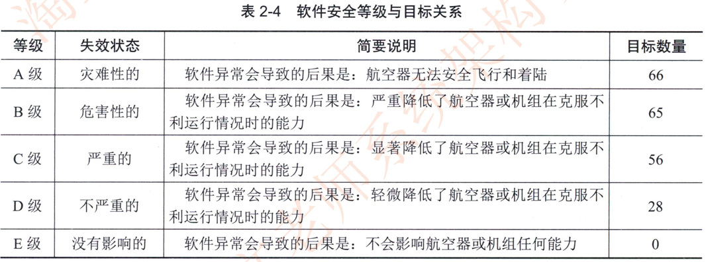
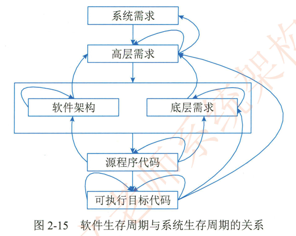
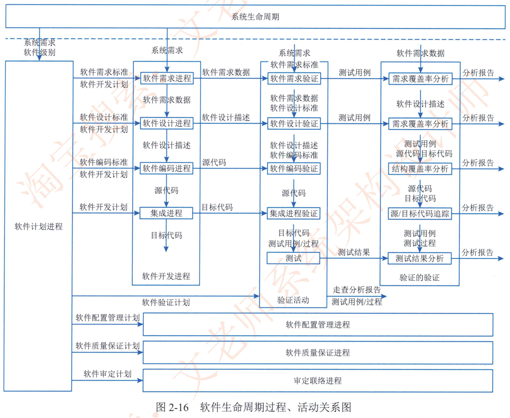

# 2.4.4安全攸关软件的安全性设计

美国电气和电子工程协会 （IEEE） 将安全攸关软件定义为： "用于一个系统中 ，可能导致不可接受的风险的软件"在航空航夭。轨道交通和核工业等领域中，其系统的安全性保障是至关重要的。因为一旦飞行器出现安全问题。将会带来机毁人亡的重大灾难。如今。嵌入式计算机及软件在这些领域中起着主导作用如何设计一款高安全高可靠的嵌入式软件，已成为软件业亟待解决的问题。

NASA 8719.13A 给出了软件安全 （Safety） 的定义。即 ^在软件生命周期内，应用安全性工程技术。确保软件采取积极的措施提高系统安全性，确保降低系统安全性的错误，使其减少或控制在一个风险可接受的水平内" 。严格来说。安全性属于一种系统特性。软件自身从本质上无从谈起是安全还是不安全。然而。当软件是一个安全攸关系统的一部分时。它可能引起或助长不安全的因素，从而影响系统的安全性=也正因如此。对于是否存在软件安全性说法一直存在较大争议。认为安全性只用系统才有。安全性分析应自上而下。安全性分析离不开所适用的场景。 

为了开发出能强化安全性的软件，必须首先理解软件所运行的系统，对整个系统进行安全性评估。通过对系统功能需求和系统体系结构的安全性分析，也能识别出相应的安全性需求，并将之反馈到系统需求中，作为系统需求的一部分共同作为软件。硬件开发的基础。根据软件对安全性的不同影响程度，利用软件开发保证级别的概念来对软件进行分类和区别对待，即对安全攸关软件分配不同的开发保证级别，对级别越高的功能要求执行越多的开发和验证活动，要求越多的依赖性证据，要求越多的错误要被识别和排除。不同软件开发保证级别，软件开发成本不同，甚至相差极大，因此开发保证级别的分配对于一个组织来说也不是越高越好，因为越高的开发保证级别代表了越大的成本。合理的功能分配。体系结构设计会帮助改善软件开发保证级别分配。从而降低软件研发成本和风险。

在安全攸关软件设计中有很多方法可以参考。而 Do-178 标准中的 Software Considerations iAirborne System and Equipment Certification 是美国 FAA 制定的一套民用飞机适航标准中针对机载软件而制定的 "机载系统/设备合格审定中的软件考虑" 唯一标准，此标准被航空。航天等安全攸关领域普遍采用本节概要介绍 D0-1788  对高安全软件开发的要求。

1982 年由 RICA 和 EUROCAE 正式发布了 DO-178 版， 这是民用航空机载软件开发中安全保证的一个里程碑1992年发布的 Do-178 第三版 （B版）称为Do-1788。现在，DO-1788 早就成了国际公认的民用航空机载软件的开发标淮。一架民用飞机 （相对军用飞机而言）不经过民航标准体系" 的适航认证，是不可以飞行的。而这个 《民航标准体系" 中，针对机载软件适航认证的，就是D0-1788标准。经过再次完善和补充。2011年形成了 DO-178C 标准，它将工具鉴定，基于模型的开发验证技术。面向对象的技术和形式化验证技术纳入适航验证中。

## 1.DO-178B的目的和内容

DO-178B  的目的是为制造机载系统和设备的机载软件提供指导，使其能够提供在满足符合适航要求的安全性水平下完成预期功能为了满足该目标，D0-178B 给予了以下3方面的指导。

1. 软件生命周期过程的目标。
   
2. 为满足上述目标要进行的活动
   
3. 证明上述目标己经达到的证据，也即软件生命周期数据。

在DO-178B中，目标、过程、数据是软件适航的基本要求。这三方面适航要求是辩证统一的关系，即一旦选择了 D0-178B 标准作为符合性方法。就必须满足该标准所定义的所有适航目标，而满足这些适航目标的途径则是执行该标准所建议的过程和活动，为证明这些适航目标被满足，应按照该标雄所定义的软件生命周期数据来组织相关证据 <D0-1788  的主要内容就是介绍目标。过程。数据这三个方面的适航要求。目标。过程和数据三个因素是 D0-1788 的精髓，它贯穿在整个软件生命周期各个过程之中。

1.  目标。

	00-178B 标准规定了软件整个生命周期需要达到的 66个目标。在 D0-1788 中，根据软件在系统中的重要程度将软件的安全等级分为 A~E 五级，不同安全等级的软件，需要达到目标要求不同。其分布详见表2-4。

2. 过程

	DO-178B 标淮把软件生命周期分为 "软件计划过程"《软件开发过程" 和 "软件综合过程" ，其中软件开发过程和软件综合过程叉分别被细分成4个子过程。

3. 数据。

	DO-178B 把软件生命周期中产生的文档。代码。报表记录等所有产品统称为软件生命周期数据D0-178B  仅仅定义的是软件生命周期过程。在嵌入式系统中，软件的需求是来自系统分解给它的需求。二者是密不可分的。图2-15 展示了软件生存周期与系统生存周期的关系。

## 2.DO-178B 的软件生命周期

DO-178B标准将软件生命周期分为 "软件计划过程""软件开发过程"  和 "软件综合过程" ，其中软件开发过程和软件综合过程又分别被细分成4个子过程

### 1 ）软件计划过程

软件计划过程策划和协调软件生命周期的所有活动。预测软件生命周期的过程和数据是否符合适航要求。制订一系列软件计划和软件标准，用以指导软件开发过程和软件综合过程活动

### 2）软件开发过程

软件开发过程包含了生产软件产品的所有活动<整个过程所有活动的共同目标就是实现软件产品的自顶向下由粗及细。从无到有的生产软件开发过程又包括了软件需求过程。软件设计过程。软件编码过程和集成过程4个子过程。

1.  软件需求过程。它包含了根据系统生命周期的输出来开发软件高层需求的所有活动。
2. 软件设计过程。它包含了对高层需求进行细化。开发软件体系结构和低层需求的所有活动。
3. 软件编码过程。它包含了根据软件体系结构和低层需求编写源代码的所有活动。
4. 集成过程。它包含了对源代码和目标码进行编译。链接并加载到目标机，形成机载系统或设备的所有活动。

### 3 ）软件综合过程

软件综合过程包含了验证软件产品、管理软件产品、控制软件产品，以保证软件产品和软件过程的正确、受控和可信的所有活动。软件综合过程又包含了软件验证过程、软件配置管理过程、软件质量保证过程、审定联络过程 4个子过程。

1.  软件验证过程。它包含了对软件产品和软件验证结果进行技术评估以保证其正确性，合理性完好性。一致性。无歧义性等特性的所有活动。软件验证依然是一项十分复杂的活动，D0-178B 中根据验证活动的分类。列出了这些验证活动应该实现的目标。

2. 软件配置管理过程。它包含对数据进行配置标识。基线建立。更改控制。软件产品归档等一系列活动。这个过程中所有活动的目标就是实现软件生命周期数据的配置管理。

3. 软件质量保证过程=它包含对数据和过程进行审计的所有活动。整个过程所有活动的共同目标就是评价软件生命周期过程及其输出， 保证过程的目标得以实现， 缺陷得以检测，软件产品和软件生命周期数据与合格审查要求一致。

4. 审定联络过程。它包含了软件研制单位与合格审查机构之间建立交流和沟通的所有活动。**从工作流关系分析 DO-178B  定义的软件生命周期全过程的流程关系如图2-16所示。这里把计划过程_开发过程和综合过程纵向并排，并在过程的流向之间标明了软件生存周期的数据项，可以清晰地展示出过程与过程。过程与数据的关系。在图的顶部指明了来自系统生命周期过程的输入。**

   

## 3.DO-178与 CMMI 差异

CMM 能力成熟度模型是 1994年由美国国防部与卡内基-梅隆大学的软件工程研究中心以及美国国防工业协会共同开发和研制的，其目的是帮助软件企业对软件工程过程进行管理和改进，增强开发与改进能力，从而能按时不超预算地开发出高质量的软件，同时也用于采办方评估和选择软件供应商2002年推出了能力成熟度模型集成 （CMMI）把开发模型 CMMI-Dev服务模型 CMMI-SVC  采购模型 CMMI-ACQ  人力模型 P-CMM 等多个领域能力成熟度模型集成到一个框架中去。

DO-178与 CMMI 是目前承担安全攸关软件开发企业最为关注的两个标准，二者的主要区别如下。

1. CMMI 是从过程改进的视角，  对软件开发的技术与管理提出要求。覆盖了从个人`项目及组织三个层次的要求，更关注组织整体软件能力提升。DO-178 是从适航审定视角， 对软件开发的技术与管理过程提出要求。更关注项目软件质量对于安全性的影响。所以00-178覆盖的过程范围比 CMMI 少，比如 DO-178C 对于项目监控过程。风险管理过程。培训过程等并没有提出明确要求。

2. CMMI 主要由实践组成，实践是各行业最佳实践的抽象（去环境〉方法）提炼。而DO-178C 过程主要由目标。活动与数据组成，活动虽不代表具体工作步骤。但活动要求比较具体。并且对过程输出（数据）提出了明确要求，结合DO-178 的配置管理过程，对数据管理与控制的要求也较为具体。

3.  CMMI 是集成了系统。软件和硬件等视角，所以在内容和措辞上必须兼顾多个场景，容易产生歧义。而 DO-178 聚焦软件，更容易为软件工程师所理解 （不代表容易做到）。

总之，DO-178 比 CMMI 的目标更清晰，要求更具体。而且是针对安全攸关软件的。这两个标准都侧重于要求。而不是具体方法和步骤。对一个企业而言 ，不仅要关注一个项目的成功，还要在多个项目中持续获得成功，而且是商业成功 （包括质量。进度。成本等） ，这就需要建立更为系统的软件过程体系。在这一点上 CMMI 更有指导性。过程改进思想的本质是过程不断丰富和优化的过程，在这个过程中需要融合不同标准与方法的要求以及实践中的经验与教训的总结。