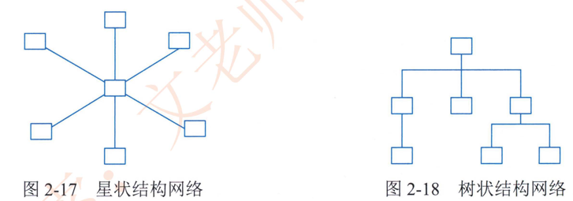
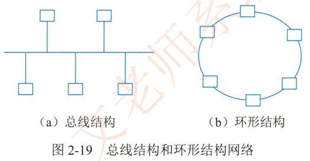
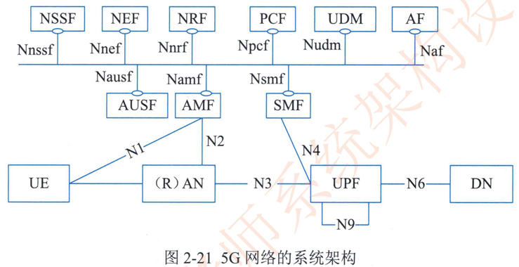
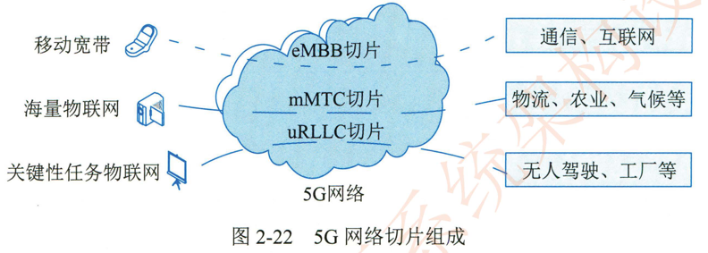

# 2.5.3网络技术

网络通常按照网络的覆盖区域和通信介质等特征来分类，可分为局域网（LAN），无线局域网（WLAN） ， 城域网 （MAN）， 广域网（WAN） 和移动通信网等。

## 1.局域网 （ LAN ）

局域网（Local Area Network，LAN） 是指在有限地理范围内将若干计算机通过传输介质互联成的计算机组 （即通信网络），通过网络软件实现计算机之间的文件管理。应用软件共享。打印机共享工作组内的日程安排，电子邮件和传真通信服务等功能=局域网是封闭型的，比如可以由办公室内的两台及以上计算机组成，也可以由一个公司内的若千台计算机组成。

### 1）网络拓扑

局域网专用性非常强，具有比较稳定和规范的拓扑结构=常见的局域网拓扑结构有星状结构。树状结构一总线结构和环形结构

1.  星状结构。网络中的每个结点设备都以中心结点为中心，通过连接线与中心结点相连，如果一个结点设备需要传输数据，它首先必须通过中心结点。如图2-17所示这种结构的网络系统中，中心结点是控制中心，任意两个结点间的通信最多只需两步，所以； 传输速度快，网络构简单。建网容易。便于控制和管理。这种结构的缺点是可靠性低，网络共享能力差。并且一旦中心结点出现故障则导致全网瘫痪。

2. 树状结构。树状结构网络也被称为分级的集中式网络，如图2-18所示，其特点是网络成本低，结构简单。在网络中，任意两个结点之间不产生回路，每个链路都支持双向传输，结点扩充方便。灵活，方便寻查链路路径。但在这种结构的网络系统中，除叶结点及其相连的链路外，任何一个工作站或链路产生故障都会影响整个网络系统的正常运行。

3. 总线结构。总线结构网络是将各个结点设备和一根总线相连，如图2-19（a）所示。网络中所有的结点设备都是通过总线进行信息传输的=在总线结构中，作为数据通信必经的总线的负载能力是有限度的，这是由通信媒体本身的物理性能决定的。总线作为连接各结点设备通信的枢纽。它的故障将影响总线上每个结点的通信。

4. 环形结构。将网络中各结点通过一条首尾相连的通信链路连接起来。形成一个闭合环形结构网，如图2-19（b）所示。环形结构的网络中各结点设备的地位相同，信息按照固定方向单向流动，两个节点之间仅有一条通路，系统中无信道选择问题，任一结点的故障将导致物理瘫痪。由于环路是封闭的，所以环形结构的网络不便于扩充，系统响应延时长，且信息传输效率相对较低。

   

5. 网状结构。网状网络中的任何结点彼此之间均存在一条通信链路，任何结点故障不会影响其他结点之间的通信但这种拓扑结构的网络布线较为烦琐，且建设成本高，控制方法复杂。

### 2）以太网技术

以太网（Etheret） 是一种计算机局域网组网技术IEE 制定的 IEEE 802.3 标准给出了以太网的技术标准。它规定了包括物理层的连线。电信号和介质访问层协议的内容。以太网是当前应用最普遍的局域网技术。

1. 以太网帧结构在以太网链路上的数据包被称作以太帧。其结构如图2-20所示

	
	
	DMAC 代表目的终端的 MAC 地址，SMAC 代表源 MAC 地址，LengthType 字段长度是2字节，若该字段的值大于1500，则代表该数据帧的类型 （比如该帧是属于哪个上层协议的数据单元）；若该字段的值小于1500，则代表该数据帧的长度DATAIPAD 代表具体数据。以太网数据帧的最小长度必须不小于64字节 （根据半双工模式下最大距离计算获得的） ，如果数据长度加上帧头不足64字节，需要在数据部分增加填充内容。当 Length/Type 取值大于 1500的时候，MAC 子层可以根据 Length/Type 的值直接把数据帧提交给上层协议，由上层协议进行分帧处理。这种结构为当前较为流行的 ETHERNET_II 协议，大部分计算机都支持这种结构。FCS则是帧校验字段，用于判断该数据帧是否出错。

2. 最小帧长。由于 CSMA / CD 算法限制，以太网帧的最小长度为64字节。高层协议要保证此长度。如果实际数据不足 64个字节，则高层协议必须进行填充。数据域的长度上限可以灵活设置，但通常被设置为1500字节。

	规定最小帧长的原因是为了避免发生某结点已经将一个数据包的最后一个 BIT 发送完毕，但这个报文的第一个 BIT 还未传送到距离较远的结点。这可能使得这些结点认为线路空闲而发送数据，导致链路上数据发送冲突。

3. 最大传输距离。以太网的最大传输距离没有严格限制，由线路质量信号衰减程度等因素决定。

4. 流量控制当通过交换机端口流量过大，超过了它的处理能力时，就会发生端口阻塞。网络拥塞一般是由于线速不匹配 （如 IOOM 向 IOM 端口发送数据） 和突发的集中传输而产生的。它可能导致延肘增加丢包和重传增加这几种情况，使网络资源不能有效利用流量控制的作用是防止在设备出现阻塞情况下丢帧。

在半双工方式下。流量控制通过反压（Back-Pressure） 技术实现，模拟产生碰撞。使得信息源降低发送速度。

在全双工方式下，流量控制一般遵循 IEEE 802.3  标淮。IEE 802.3x 规定了一种 64字节的PAUSEMAC 控制帧格式当端口发生阻塞时，交换机向信息源发送 "PAUSE" 帧。告诉信息源暂停一段时间再发送信息在实际网络中，尤其是一般局域网产生网络拥塞情况极少，所以有的厂家交换机并不支持流量控制。高性能的交换机通常都支持半双工方式下的反向压力和全双工的 IEEE 802。3x流控。有的交换机的流量控制将阻塞整个 LAN 的输入，降低整个 LAN 的性能；高性能的交换机采用的策略是仅仅阻塞向交换机拥塞端口输入帧的端口，保证其他端口用户的正常工作。

## 2.无线局域网 （ WLAN ）

无线局域网 WLAN（ Wireless Local Area Networks _利用无线技术在空中传输数据。话音和视频信号。无线局域网所使用的关键技术。除了红外传输技术。扩频技术。窄带微波技术外还有一些其他技术，如调制技术。加解扰技术。无线分集接收技术功率控制技术和节能技术。无线局域网在室外主要有以下几种结构：  点对点型点对多点型。多点对点型和混合型与有线网络相比，无线局域网具有安装便捷。使用灵活。经济节约。易于扩展等优点。

### 1 ） WLAN 标准

IEEE 802.11 是最早的无线局域网技术标准，当时传输速率只有1~ 2Mb/s，采用无连接的协议。

IEEE 802.11b标雄的速率可达11Mb/s，IEEE 802.11a 标淮的传输速率可达到 54Mb/s。同时还出现了 IEEE 802.11b标淮；该标准具有与 IEE 802.11a 标淮一样的接入速率，同时兼容 IEE802。116标准；工作于免费的2。4GH2 频段， 价格比 IEE802.11a 更便宜。之后出现了IEEE802.111新标准，其传输速率可达 200Mb/s 以上。

### 2 ）WLAN 拓扑结构

在 WLAN 中，通常使用的拓扑结构主要有3种形式：点对点型、HUB 型和全分布型。这3种结构解决问题的方法各有优缺点，目的都是让用户在无线信逍中，获得与有线 LAN 兼容或相近的传输速率。

1. 点对点型。

	典型的点对点结构是通过单频或扩频微波电台、 红外发光二极管。红外激光等方法。连接两个固定的有线 LAN 网段。实际上是作为一种网络互联方案。无线链路与有线LAN 是通过桥路器或中继器完成连接的点对点拓扑结构简单，采用这种方案可获得中远距离的高速率链路。由于不存在移动性问题，收发信机的波束宽度可以很窄，虽然这会增加设备调试难度。但可减小由波束发散引起的功率衰耗。

2. HUB 型。

	由一个中心结点（HUB） 和若干外围节点组成外围结点既可以是独立的结点，也可与多个用户相连。中心 HUB 作为网络管理设备，为访问有线 LAN 或服务器提供逻辑接入点，并监控所有节点对网路的访问，管理外围设备对广播带宽的竞争，其管理功能由软件具体实现。在此拓扑中，任何两外围结点间的数据通信都须经过 HUB， 是典型的集中控制式通信。采用这种结构的网络具有用户设备简单。维护费用低，网络管理单一等优点，并可与微蜂窝技术结合，实现空间和频率复用。但是。用户之间的通信延迟增加。网络抗毁性能较差。中心结点的故障容易导致整个网络的瘫痪。

3. 完全分布型。

	完全分布结构目前还无具体应用，仅处于理论探讨阶段，它要求相关结点在数据传输过程中发挥作用。类似于分组无线网的概念。对每一结点而言， 一般仅只有网络的部分拓扑信息，但它可与邻近结点以某种方式分享各自拓扑结构信息。基于此完成一种分布路由算法，使得传输路径上的每一结点都要协助源结点数据传送至目的结点。

分布式结构抗毁性能好，移动能力强，可形成多跳网。适合较低速率的中小型网络。但对于用户结点而言，复杂性和成本较其他结构大幅度提高。网络管理困难，并存在多径千扰问题，同时随着网络规模的扩大。其性能指标快速下降。但在军事领域中，分布式 WLAN 具有很好的应用前景。

## 3.广域网 （ WAN ）

广域网是一种将分布于更广区域 （比如一个城亦一个国家甚至国家之间）的计算机设备联接起来的网络。它通常是电信部门负责组建。经营和管理。并向社会公众提供通信服务。广域网由通信子网与资源子网组成。通信子网主要是由一些通信结点设备和连接这些设备的链路组成。通信结点设备负责网络中数据的转发。其链路用于承载用户的数据，一般分为传输主千链路和末端用户线路。广域网的通信子网可以利用公用分组交换网。卫星通信网和无线分组交换网来构建。将分布在不同地区的局域网或计算机系统互连起来。达到资源共享的目的<资源子网是指网络中实现资源共享功能的设备及其软件的集合=资源子网主要指网络资源设备，如信息服务或业务服务器。用户计算机。网络存储系统。独立运行的网络数据设备。网络上运行的各种软件资源。数据资源等。

### 1 ）广域网相关技术

1. **同步光网络**。同步光网络 （Synchronous Optical Networking；SONET ） 是使用光纤进行数字化信息通信的一个标淮。同步数字体系 （Synchronous Digital Hierarchy，SDH） 标准从SONET 发展而来SONET 是由美国标淮化组织颁布的标准，SDH 是国际电信联盟颁布的标准，两者均为传输网络物理层技术SONET 和 SDH 两种技术都被广泛应用，SONET 应用在美国和加拿大，SDH 应用于其他国家SONET 和 SDH 体制都能够用来封装较早的数字传输标准。比如 PDH （Plesiochronous Digital Hierarchy） 标淮，或者直接用来支持 ATM 以及 SONET 上的分组业务 （Packet Over SONET）

2. **数字数据网**。数字数据网 DDN （Digital Data Network） 利用数字信道提供半永久性连接电路以传输数据<它可以满足各类租用数据专线业务的需要。它具有传输速率高。传输质量高。协议简单。连接方式灵浯电路可靠性高和网络运行管理简便等优点。

3. **帧中继**。帧中继 FR（Frame Relay） 是一种高性能广域网技术，运行于 OSIIRM 的物理层和数据链路层。是一种数据包交换技术。是X.25 网络的简化版本，但具有更高性能和传输效率。帧中继采用虚电路技术，充分利用网络资源。具有吞吐量高。时延低，适合突发性业务等特点。

4. **异步传输技术**。异步传输模式 （Asynchronous Transfer Mode，ATM） 是以信元为基础的面向连接的一种分组交换和复用技术。它具有高速数据传输率，可满足多种业务 （如语音数据，传真。实时视频等） 传输的需要。在 ATM 中信元不仅是传输的基本单位。也是交换的信息单位。由于信元长度固定 （53个字节） ，可高速地进行处理和交换，去除不必要的数据校验，交换速率大大高于其他传统数据网，其典型速率为 150Mb/s。

   
### 2 ）广域网的特点

广域网具有下述特点：

1. 主要提供面向数据通信的服务，支持用户使用计算机进行远距离的信息交换。
2. 覆盖范围广，通信的距离远。广域网没有固定拓扑结构。
3. 由电信部门或公司负责组建管理和维护，并向全社会提供面向通信的有偿服务等。

### 3）广域网的分类
广域网可以分为公共传输网络。专用传输网络和无线传输网络。

1. 公共传输网络一般是由政府电信部门组建管理和控制，网络内的传输和交换装置可以提供（或租用）给任何部门和单位使用。公共传输网络大体可以分为电路交换网络和分组交换网络两类。
2. 专用传输网络是由单个组织或团体自己建立。使用-控制和维护的私有通信网络。个专用网络起码要拥有自己的通信和交换设备，它可以建立自己的线路服务，也可以向公用网络或其他专用网络进行租用。专用传输网络主要是数字数据网（DDN）DDN可以在两个端点之间建立一条永久的。专用的数字通道它的特点是在租用该专用线路期间，用户独占该线路的带宽。
3. 无线传输网络主要是移动无线网，典型的有 GSM、TD-SCDMA/WCDMA/CDMA2000、LTE 和 5G等。

## 4.城域网（MAN ）

城域网是在单个城市范围内所建立的计算机通信网，简称 MAN （Metropolitan AreaNetwork ）由于采用有源交换元件的局域网技术。网络中传输时延较小。它的传输媒介主要采用光缆。传输速率在 100 Mb/s 以上cMAN 基于一种大型的 LAN，通常使用与 LAN 相似的技术，但 MAN 的标准称为分布式队列双总线 DQDB （Distributed Queue Dual Bus） ，即 IEEE802.6。DQDB 是由双总线构成。将加入 MAN 的所有计算机都连接起来。

如果说局域网或广域网通常是为了一个单位或系统服务的，那么城域网则是为整个城市而非某个特定部门服务。它向上与骨干网相连，向下将本地所有的联网用户与城市骨干网相连。 城域网络通常分为3个层次：  <mark>核心层</mark>、<mark>汇聚层</mark>和<mark>接入层</mark>。核心层主要提供高带宽的业务承载和传输，完成和已有网络 （如 ATM FR，DDN  卫网络）的互联互通，其特征为宽带传输和高速调度。汇聚层的主要功能是给业务接入结点提供用户业务数据的汇聚和分发处理。同时要实现业务的服务等级分类。接入层利用多种接入技术，进行带宽和业务分配。实现用户的接入。
## 5.移动通信网
### 1 ）移动通信网发展

移动通信网络自从20世纪80年代出现以来，经历近40年的发展历程。最初采用模拟信号传输，即将电磁波进行频率调制后；将语音信号转换到载波电磁波上，载有信息的电磁波发布到空间后由接收设备接收，并从载波电磁波上还原语音信息，完成人与人之间的通话，即 1G通信时代。由于 1G采用模拟信号传输，所以其容量非常有限， 一般只能传输语音信号，且存在语音品质低。信号不稳定：涵盖范围不够全面。安全性差和易受干扰等问题。之后出现的2G移动通信采用数字调制技术。移动通信系统的容量有了增加。此时手机可以上网了 ，虽然数据传输速度很慢。速率为9.6~14.4kb/s，但可传输文字信息。这也是移动互联网发展的起点。随后，移动通信网络发展到36时代。3G延续2G数字数据传输技术，但通过开辟新电磁波频谱及研发新标淮，使得3G传输速率可达384kb/s，在室内稳定环境下甚至可达2 Mbls 的速率，比2G提升了百倍之多。由于采用更宽频带，传输稳定性大大提高。正是由于速度大幅提升和通信稳定性的提高，使大数据的传送成为可能。催生了移动通信多样化的应用随着移动通信自身演进以及移动互联网发展的需要。诞生了 4G 移动通信技术。4G采用更先进的通信协议和技术，理论上网速度为36的几十倍，实际用户上网体验与固网 20Mbls 家庭宽带相当。4G可满足入们使用手机流畅观看高清电影，进行大数据传输等需要=4G 己经像 "水电" 一样成为入们生活中不可或缺的基本资源。像微信。微博。视频。移动支付等手机应用成为生活中的必需，人们无法想象离开手机的生活。因此。 4G 将人类带进了移动互联网快速发展的时代。随着社会信息化发展步伐的加快，以及社会各个领域对移动通信需求的日益多样化的驱动，诞生了5G通信网络，5G不再由某项业务能力或者某个典型技术特征加以定义。它不仅是更高速率。更大带宽，更强能力的技术。而且是一个多业务。多技术融合的网络，更是面向业务应用和用户体验的智能网络。最终打造以用户为中心的信息生态系统。5G 网络的基本特征是高速率 （峰值速率可大于20Gb/s，相当于4G的20倍），低肘延 （网络时延从4G 的 50ms 缩减到 1ms） ， 海量设备连接 （满足1000 亿量级的连接） ，低功耗基站更节能。终端更省电）。

### 2 ） 5G 网络的主要特征

1. 服务化架构。

    为满足5G时代行业应用的差异化需求，网络需要具备软件快速迭代和升级的能力，以加快业务创新，低成本试错，实现商业敏捷，3GPP （3rd Generation PartnershipProject） 在SG 核心网中引入了 SBA（Service-based Architecture） 服务化架构，实现网络功能的灵活定制和按需组合。图2-21给出了5G 网络的系统架构。

	

	在5G通信系统中涉及的主要网元 Nr（Network Function ） 如图2-21所示。其中控制面 NF包括：认证服务功能 （Authentication Server Function，AUSE） ， 接入和移动性管理功能（Accessand Mobility Management Function，ANF ） 网络能力开放功能 （Network Exposure Function，NEF ） ，网络存储功能（Network Repository Function，NRF ） ，网络切片选择功能 （NetworkSlice Selection Function；NSSF ）策略控制功能 （Policy Control Function，PCE） ， 会话管理功能 （Session Management Function，SMF ） ，统一数据管理功能 （Unified Data Management，UDM），应用功能 （Application Function，AE ） 等。用户面 NF 包括用户面功能（User PlaneFunction，UJPF ） ，另外包括用户设备 （User Equipment，UE） ， 接入网或无线接入网（Radio）Access Network；（尽） AN） 等。数据网（Data Network， DN ） 泛指运营商服务网络Internet互联网或者是笫三方服务网络等。它是5G 通信系统要接入的业务网络。

	5G 系统控制面网元 （如 AMF、SMF、NRF、NSSF 等）之间采用服务化接口 （ServiceBased Interface，SBI） 互通，使 HTTP 协议作为承载协议。其中 AMF 和接入网（AN） 采用点到点方式通信，使用 SCTP 协议作为承载协议， SMF 和用户面网元 （UPF ） 之间采用点到点通信，使用 UDP 协议作为承载协议。UPF 和（R） AN 之间采用点到点方式通信，使用 UDP 作为承载协议。UDP 和 DN 之间基于 /卫  协议通信

2. 网络切片。

	5G 时代网络服务的对象不再是单纯的移动手机。而是各种类型的设备。如移动手机。平板。固定传感器和车辆等；  应用场景也更加多样化，如移动宽带大规模物联网，任务关键型互联网等；  要满足的要求也愈加多样化，如移动性。安全性。时延性和可靠性等。这便催生了网络切片的诞生。通过网络切片技术在单个独立的物理网络上切分出多个逻辑网络，从而避免了为每一个服务建设一个专用的物理网络。极大地降低了建网和运维成本。图2-22描述了根据不同群体与不同需求（应用场景）划分的不同网络切片。

	在图2-22中，移动宽带 （eMBB） 的应用场景如面向 4K/8K 超高清视频全息技术。增强现实/虚拟现实等应用，对网络带宽和速率要求较高；  海量大规模物联网（MMTC） 的应用场景如海量的物联网传感器部署于测量 建筑。农业。物流。智慧城市。家庭等领域，这些传感器设备是非常密集的，规模庞大。且大部分是静止的，对时延和移动性要求不高；  关键任务物联网 （uRLLC） 的应用场景如无人驾驶，车联网自动工厂。远程医疗等领域；要求超低时延和超高可靠性。

	

	为了满足5G 网络切片组网的需要，引入了 SPN （Slicing Packet Network） 技术，其中包括基于灵活以太网（Flexible Ethernet，FlexE） 的硬切片技术FlexE 基于 PHY 层的切片转发。提供刚性管道隔离，实现带宽灵活分配基于 FlexE Cross-connection 的 FlexE Channel 则将业务隔离从端口级扩展到网络级，可对不同业务实现端到端子信道隔离，为5G承载网络切片提供最佳转发面支撑。同时 ，基于 FlexE Channel 技术的保护倒换能做到 1ms 以内，把电信级保护提升到了工业控制级。