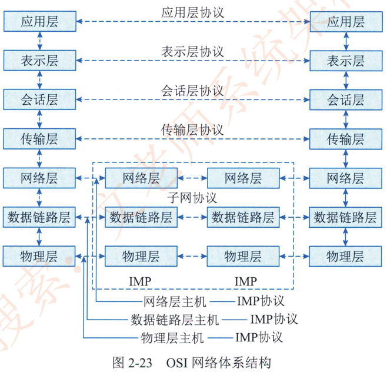
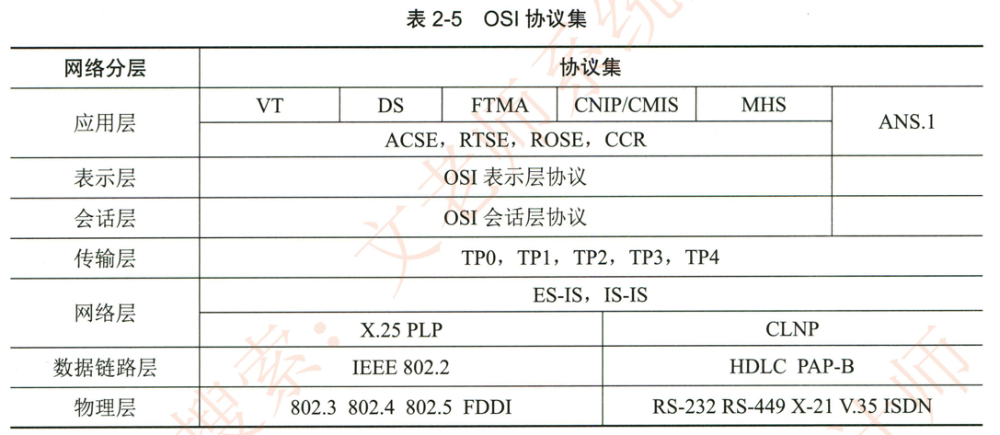
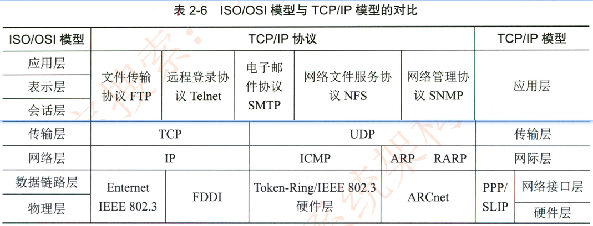

# 2.5.4组网技术

## 1.网络设备及其工作层级

网络设备是连接到网络中的物理实体。网络设备的种类繁多，且与日俱增。基本的网络设备有集线器。中继器。网桥。交换机。路由器和防火墙等。

### 1）集线器

集线器是最简单的网络设备。在集线器中，从一个端口收到的数据被转送到所有其他端口，无论与端口相连的系统是否准备好。集线器还有一个端口被指定为上联端口，用来将该集线器连接到其他集线器或路由设备等以便形成更大的网络。

### 2） 中继器

中继器是局域网互连设备，工作于 OSI 体系结构的物理层，它接收并识别网络信号，然后再生信号，将其发送到网络的其他分支上。为了保证中继器正常工作，需要保证每一个分支中的数据包和逻辑链路协议相同。此外，中继器可以用来连接不同物理介质，并在各种物理介质中传输数据包。

### 3）网桥

网桥工作于 OSI 体系的数据链路层=OSI 模型数据链路层以上各层的信息对网桥来说是透明的。网桥包含了中继器的功能和特性。不仅可以连接多种介质，还能连接不同的物理分支，如以太网令牌网。能将数据包在更大的范围内进行传送。

### 4）交换机

交换机是一种工作在 OSI 七层协议中的数据链路层，为接入交换机的任意两个网络结点提供独享的转发通路，将从一个端口接收的数据通过内部处理转发到指定端口。交换机具备自动寻址和交换的功能，同时具有避免端口冲突。提高网络吞吐 （Throughput） 的能力。

### 5）路由器

路由器工作在 OSI 体系结构中的网络层，它可以在多个网络上交换和路由数据包。路由器可通过在相互独立网络中交换路由信息以生成路由表来达到数据包的路径选择。路由表包含网络地址。连接信息路径信息和发送代价等属性。路由器通常用于广域网或广域网与局域网的互连。

### 6 ）防火墙 （ Firewall）

防火墙是网络中一种重要设备。它通常作为网络的门户为网络的安全运行提供保障。通过在防火墙设置若干安全规则实现对进出网络的数据进行监视和过滤。在网络中通常采用硬件防火墙。硬件防火墙是指把防火墙程序做到芯片里面由硬件执行这些功能。能减少 CPU 的负担。使路由更稳定。它的安全和稳定，直接关系到整个网络的安全。

## 2.网络协议

### 1 ）开放系统互连模型

开放系统是指遵从国际标准的一能够通过互连而相互作用的系统。系统之间的相互作用只涉及系统的外部行为。而与系统内部的结构和功能无关。国际标准化组织（InternationalStandard Organization， ISO） 公布了开放系统互连参考模型 （OSIIRM）OSIIRM 为开放系统互连提供了一种功能结构的框架。OSI/RM 是一种分层的体系结构，参考模型共有7层，分层的基本想法是每一层都在它的下层提供的服务基础上提供更高级的增值服务，而最高层提供能运行分布式应用程序的服务=这样，通过分层的方法将复杂的问题分解，并保持层次之间的独立性。OSI/RM 的网络体系结构如图2-23 所示，由低层至高层分别为物理层 （Physical Layer） ， 数据链路层 （Datalink Layer） 网络层（Network Layer）、传输层 （Transport Layer ）、会话层 （SessionLayer ）、表示层（Presentation Layer） 、和应用层 （Application Layer）。

### 2 ） OSI 协议集

国际标淮化组织除了定义开放系统互连 （Open System Interconnection，OSI） 参考模型。还开发了实现7个功能层次的各种协议和服务标准，通称为 OSI 协议。与其他协议一样，OSI 协议是实现某些功能的过程描述和说明。每一个 OSI 协议都详细地规定了特定层次的功能特性。OSI 协议集如表2-5所示。

### 3 ） TCP/IP 协议集

TCP/P （Transmission Control Protocol /Internet Protocol） 作为 Internet 的核心协议。已被广泛应用于局域网和广域网中，TCPIP 的主要特性为逻辑编址。路由选择域名解析。错误检测和流量控制以及对应用程序的支持等TCP/P 是个协议族，主要包括因特网协议（皿）。传输控制协议 （TCP） ， 用户数据报协议 （UDP） ， 虚拟终端协议 （TELNET）文件传输协议 （FTP），电子邮件传输协议 （SMIP）， 网上新闻传输协议 （NNIP） 和超文本传送协议 （HTIP） 等8个。

TCP/IP 网络协议模型共分为网络接口层网际层传输层和应用层4层。对于网络访问层，在 TCP/P 参考模型中并没有详细描述，只是指出主机必须使用某种协议与网络相连。网际层是整个 TCPIP 体系结构的关键部分，其功能是使主机可以把分组发往任何网络，并使分组独立地传向目标。传输层使源端和目的端机器上的对等实体可以进行会话<这一层定义了两个端到端的协议：  传输控制协议 （TCP） 和用户数据报协议 （UDP）。

### 4 ） ISO/OSI 模型与 TCP/IP 模型的对比

ISO/OSI 模型与 TCP/IP 模型的对比如表2-6所示。

如表2-6所示，TCP/IP 分层模型由4个层次构成，即应用层、传输层、网际层和网络接口层。网际层定义的协议除了 IP 外， 还有 ICMP（Internet Control Message Protocol），ARP（Address Resolution Protocol）和 RARP（Reverse Address Resolution Protocol）等几个重要协议。应用层的协议有 NFS（Network File Serve）、Telnet、SMTP （Simple Mail TransportProtocol）、SNMP （Simple Network Management Protocol） 和 FTP （File Transfer Protocol） 等Internet的地址主要有两种表示形式：  域名格式和IP 地址格式。域名和 IP 地址是一一对应的。IP协议版本号为4，也称之为 IPv4；IP协议版本号为6时，称之为 IPV6。

WWW（World Wide Web） 也称万维网，是指在因特网上以超文本为基础形成的信息网=它采用统一的资源定位器 （Uniform Resource Locator，URL ） 和图文声并茂的用户界面，可以方便地浏览 Internet 上的信息和利用各种网络服务。互联网常用的服务包括域名服务 （DomainName Server，DNS）WWW 服务E-mail 电子邮件服务FTP 文件传输服务Telnet 远程登录服务Gopher，等等。

## 3.交换技术

数据在网络中转发通常离不开交换机。人们日常使用的计算机通常就是通过交换机接入网络的。交换机功能包括：

1. 集线功能~提供大量可供线缆连接的端口达到部署星状拓扑网络的目的。
2. 中继功能。在转发帧时重新产生不失真的电信号。
3. 桥接功能。在内置的端口上使用相同的转发和过滤逻辑。
4. 隔离冲突域功能。将部署好的局域网分为多个冲突域。而每个冲突域都有自己独立的带宽。以提高交换机整体宽带利用效率。

### 1 ）基本交换原理
交换机是一种基于 MAC 地址识别，能完成封装转发数据包功能的网络设备。交换机可以6学习" MAC 地址，并把其存放在内部地址表中，通过在数据帧的始发者和目标接收者之间建立临时的交换路径，使数据帧直接由源地址到达目的地址，交换机需要实现的功能如下所述。
1. **转发路径学习**。根据收到数据帧中的源 MAC 地址建立该地址同交换机端口的映射，写入 MAC 地址表中
2. **数据转发**。如果交换机根据数据帧中的目的 MAC 地址在建立好的 MAC 地址表中查询到了，就向对应端口进行转发。
3. **数据泛洪**。如果数据帧中的目的 MAC 地址不在 MAC 地址表中则向所有端口转发，也就是泛洪。广播帧和组播帧向所有端口 （不包括源端口）进行转发。
4. **链路地址更新**。MAC 地址表会每隔一定时间 （如300s）更新一次。
### 2）交换机协议
在交换机组网中，为保证链路的可靠性通常会采用一条以上的物理链路来连接设备，因此，如果在一个交换网络中两台设备之间连接多条链路时就会产生环路。而环路的出现会导致数据转发异常，影响交换机的正常工作。而生成树协议 （STP） 就可以很好解决链路环路问题。

另外，为提高链路可靠性，或提升与邻接交换设备之间端口带宽，可采用链路聚合协议，如 802.3ad。

## 4.路由技术

应用或业务数据在网络中的传输，是依照网络路由机制来进行的。路由功能由路由器（Router） 来提供。具体包括： 

1.  <mark>异种网络互连</mark>。比如具有异种子网协议的网络互连；
2. <mark>子网协议转换</mark>。不同子网间包括局域网和广域网之间的协议转换；
3. <mark>数据路由</mark>。即将数据从一个网络依据路由规则转发到另一个网络；
4. <mark>速率适配</mark>。利用缓存和流控协议进行适配；
5. <mark>隔离网络</mark>。防止广播风暴，实现防火墙；
6. <mark>报文分片和重组</mark>。超过接口的 MTU 报文被分片，到达目的地之后的报文被重组；
7. <mark>备份</mark>。流量控制，如主备线路的切换和复杂流量控制等

### 1 ）路由原理

路由器工作在 OSI 七层协议中的笫3层，即网络层。其主要任务是接收来源于一个网络接口的数据包。通常根据此数据包的目地址决定待转发的下一个地址 （即下--跳地址） 。路由器中维持着数据转发所需的路由表；所有数据包的发送或转发都通过查找路由表来实现。这个路由表可以静态配置，也可以通过动态路由协议自动生成。

### 2）路由器协议

路由器是通过路由表来转发接收到的数据。转发策略可以是人工指定的，即通过静态配置路由的方法来指定。在较小规模网络中，人工指定转发策略没有任何问题，但是在较大规模网络中 （如跨国企业网络。 ISP 网络等） ，如果通过入工指定路由或转发策略的话，将会给网络管理员带来巨大工作量，并且管理。维护路由表也娈得十分困难。为了解决这个问题。路由协议应运而生。

路由协议 （Routing Protocol） 是一种指定数据包转送方式的协议。路由协议是运行在路由器上的协议，可以让路由器自动学习到其他路由器的网络，并且在网络拓扑发生改娈后自动更新其维护的路由表。网络管理员只需要简单配置路由协议即可，相比人工配置转发策略。路由，工作量大大减少，同时避免了人为配置可能带来的差错=路由协议通过在路由器之间共享路由信息来支持可路由协议。路由信息在相邻路由器之间传递。使得所有路由器获悉其他路由器的路径，以此路由协议创建路由表，描述网络拓扑结构；路由协议与路由器协同工作，执行路由选择和数据包转发功能。

一般来说，路由协议可分为内部网关协议 （IGP） 和外部网关协议 （EGP） 两类。

1. 内部网关协议。

	在一个自治系统 AS （Autonomous System） 内运行的路由协议称为内部网关协议 （Interior Gateway Protocol）内部网关协议可以划分为两类：  距离矢量路由协议和链路状态路由协议。

	距离矢量路由协议采用的是距离向量算法； IS-IS 和 OSPF 采用的是链路状态算法。对于小型网络，采用基于距离向量算法的路由协议易于配置和管理，且应用广泛，但在面对大型网络时，不但其固有的环路问题娈得更难解决。所占用的带宽也迅速增长，以至于网络无法承受。因此对于大型网络。采用链路状态算法的 IS-IS 和 OSPF 更为有效，并得到广泛应用。

2. 外部网关协议。

	在 AS 之间的路由协议称为外部网关协议 （Exterior Gateway Protocol，EGP） 外部网关协议最初采用的是 EGP。EGP 是为简单的树形拓扑结构设计的，随着越来越多的用户和网络加入 Internet，给 EGP 带来了很多局限性。为了摆脱 EGP 局限性，ITF 边界网关协议工作组制定了标准的边界网关协议 （BGP）。