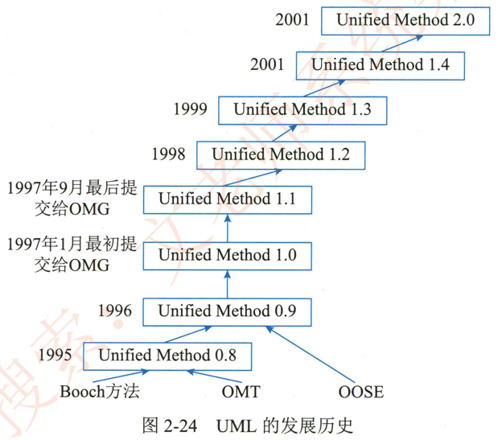
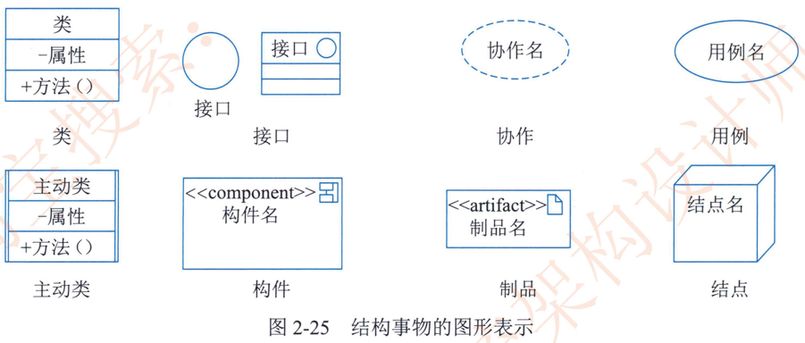
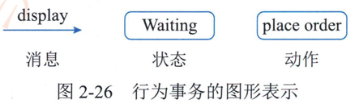
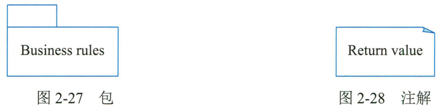
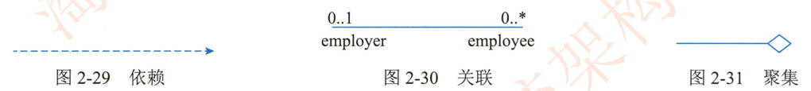
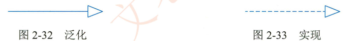
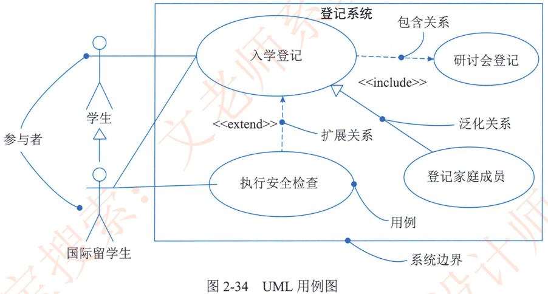

# 2.6.2计算机语言的分类

计算机语言的种类繁多，早期人们把计算机语言分成机器语言。汇编语言和高级语言三大类。而针对不同的处理器架构。机器语言和汇编语言又存在着许多种语言类。近年来。随着计算机语言的不断发展，涌现出了众多其他语言， 这里主要分别介绍机器语言、汇编语言、高级语言、建模语言和形式化语言等。

## 1.机器语言

机器语言是最早使用的程序设计语言。是第一代计算机语言。是计算机自身具有的 “本地语”。在计算机设计时，围绕的中心是指令，指令是一种基本的操作。一台计算机处理功能的大小与指令的功能以及指令的多少有关。所有指令的集合称为指令系统。也就是机器语言。机器语言是计算机能够直接接收并能识别和执行操作的语言，其优点是可以被计算机直接理解和执行，而且执行速度快 占用内存少。

由于每条机器指令就是一个0、1串，使用机器语言编程十分烦琐，且不易学、不易记、不易用、不易调试和维护，而且由于每台计算机的指令系统往往各不相同。所以。在一台计算机上执行的程序，要想在另一台计算机上执行必须另编程序，造成了重复工作。因此。机器语言是不可或缺的，但它又阻碍了计算机应用的发展，使计算机仅为少数专业人员所使用。

### 1 ）机器语言的指令格式

机器语言指令是一种二进制代码，由操作码和操作数两部分组成。计算机是通过执行指令来处理各种数据的。为了指出数据的来源。操作结果的去向及所执行的操作， 一条指令必须包含下列信息。

1. **操作码**。它具体说明了操作的性质及功能。一台计算机可能有几十条至几百条指令，每一条指令都有一个相应的操作码，计算机通过识别该操作码来完成不同的操作。

2. **操作数的地址**。 CPU 通过该地址就可以取得所需的操作数。

3. **操作结果的存储地址**。把对操作数的处理所产生的结果保存在该地址中，以便再次使用。

4. **下条指令的地址**。执行程序时，大多数指令按顺序依次从主存中取出执行，只有在遇到转移指令时 ，程序指令的执行顺序才会改变。为了压缩指令的长度。可以用一个程序计数器（Program Counter， PC） 存放指令地址。每执行一条指令， PC 的指令地址就自动+1 （设该指令只占一个主存单元） ，指出将要执行的下一条指令的地址。当遇到执行转移指令时，则用转移地址修改 PC 的内容。由于使用了 PC， 指令中就不必明显地给出下一条将要执行指令的地址。

一条指令实际上包括两种信息即操作码和地址码。操作码用来表示该指令所要完成的操作（如加、减、乘、除、数据传送等） ，其长度取决于指令系统中的指令条数。地址码用来描述该指令的操作对象。它或者直接给出操作数。或者指出操作数的存储器地址或寄存器地址 （即寄存器名 ）。

指令包括操作码域和地址域两部分根据地址域所涉及的地址数量，常见的指令格式有以下几种。

1.  **三地址指令**。一般地址域中 A1， A2 分别确定第1，笫2操作数地址，A3 确定结果地址。下一条指令的地址通常由程序计数器按顺序给出。

2. **二地址指令**。地址域中 A1 确定笫1操作数地址， A2 同时确定笫2操作数地址和结果地址。
3. **单地址指令**。地址域中 A 确定笫1操作数地址。固定使用某个寄存器存放笫2操作数和操作结果。因而在指令中隐含了它们的地址。
4. **零地址指令**。在堆栈型计算机中，操作数一般存放在堆栈顶的两个单元中，结果又放入栈顶，地址均被隐含，因而大多数指令只有操作码而没有地址域。
5. 可变地址数指令。地址域所涉及的地址的数量随操作定义而改变。如有的计算机的指令中的地址数可少至0个，多至6个。

## 2.汇编语言

为了降低使用机器语言编程的难度，人们进行了一种有益的改进，即用一些简洁的英文字母。符号串来替代一个特定指令的二进制串，例如。用 ADD 代表加法，MOV 代表数据传递等，这样一来。人们很容易读懂并理解程序在做什么。编程。纠错及维护都变得方便了，这种程序设计语言就称为汇编语言，即第二代计算机语言。

与机器语言相比。汇编语言有许多优点。程序设计入员用汇编语言写出的程序，代码短省空间。效率高。但是汇编语言仍是一种面向机器的语言，通用性差。它要求程序设计人员详细了解计算机的硬件结构，如计算机的指令系统 CPU 中寄存器的结构及存储单元的寻址方式等，并且要求程序设计入员具有较高的编程技巧。

汇编语言是机器语言的符号化描述，所以也是面向机器的程序设计语言。然而，计算机并不认识这些符号，这就需要一个专门的程序，专门负责将这些符号翻译成二进制的机器语言，这种翻译程序被称为汇编程序。汇编语言同样十分依赖于机器硬件，可移植性不好，但效率十分高。针对计算机特定硬件编制的汇编语言程序能准确发挥计算机硬件的功能和特长。程序精炼且质量高。所以至今仍是一种常用的强有力的软件开发工具。

### 1）汇编语言的语句格式

语句（Statements） 是汇编语言程序的基本组成单位。在汇编语言源程序中有3种语句：  指令语句。伪指令语句和宏指令语句 （或宏调用语句）

1. **指令语句**。指令语句又称为机器指令语句，将其汇编后能产生相应的机器代码，这些代码能被 CPU 直接识别并执行相应的操作。基本的指令有 ADD  SUB 和 AND 等。书写指令语句时必须遵循指令的格式要求。指令语句可分为传送指令。算术运算指令逻辑运算指令。移位指令。转移指令和处理机控制指令等类型。

2. **伪指令语句**。伪指令语句指示汇编程序在汇编源程序时完成某些工作。例如为变量分配存储单元地址， 给某个符号赋一个值等。伪指令语句与指令语句的区别是：  伪指令语句经汇编后不产生机器代码，而指令语句经汇编后要产生相应的机器代码。另外，伪指令语句所指示的操作是在源程序被汇编时完成的，而指令语句的操作必须在程序运行时完成。

3. **宏指令语句**。在汇编语言中。还允许用户将多次重复使用的程序段定义为宏。宏的定义必须按照相应的规定进行，每个宏都有相应的宏名。在程序的任意位置，若需要使用这段程序，只要在相应的位置使用宏名，即相当于使用了这段程序。因此。宏指令语句就是宏的引用

### 2）指令语句和伪指令语句格式

指令语句和伪指令语句有相同的语句格式，每条语句均由如下4个字段 （Fields） 组成：  名字。操作符。操作数和注释。其中，每个字段的意义如下。
1. **名字字段**（Name Field） 除少数伪指令语句必选外，其他多数语句是一个任选字段。在指令语句中，这个字段的名字叫标号。且一定是用冒号《："作为名字字段的结束符。标号是一条指令的符号地址，它代表该指令代码的第1个字节单元地址。通常在一个程序段的入口指令语句处选用标号。当程序需要转入这个程序时，就可直接引用这个标号。在伪指令语句中，对于不同的伪指令这个字段的名字有所不同，它们可以是常量名，变量名，段名。过程名等。伪指令语句的名字字段后面用空格作为结束符，不得使用冒号，这是它与指令语句的一个重要区别。伪指令语句的这些名字。有的代表一个具体常数值，有的作为存储单元的符号地址。它们都可以在指令语句和伪指令语句的操作数字段中直接加以引用。
2. **操作符字段** （Operator Field） 这是一条语句不可缺少的主要字段，它反映了这个语句的操作要求。在指令语句中，这个字段就是指令助记符，如 MOV、ADD 和 SUB 等，它表示程序在运行时 CPU 完成的操作功能。在伪指令语句中，这个字段就是本章后面将要介绍的各种伪指令，如数据定义伪指令 DB、DW、DD； 段定义伪指令 SEGMENT； 过程定义伪指令 PROC 等，它表示汇编程序如何汇编（翻译）源程序各条语句。这些伪指令的操作要求都是由汇编程序在汇编源程序时完成的。
3. **操作数字段** （Operand Field） 。 在一条语句中，本字段是否需要需要几个以及需要什么形式的操作数等都由该语句的操作符字段 （指令助记符/伪指令）确定。如果需要本字段，那么本字段与操作符字段用空格或制表符 Tab 作为分界符。如果本字段要求有两个或两个以上操作数，那么各操作数之间用逗号 “，”或空格分隔。
4. **注释字段**（Comment Field ）。这是一个任选字段。如选用本字段，必须以分号“；”作为字段的开始符。本字段可由程序设计入员编写任意字符串 ，其内容不影响程序和指令的功能，它们也不出现在目标程序中。这个字段为提高程序的可读性和可维护性提供了方便。它对某些程序段或指令加以注解，说明它们的功能和意义。当需要进行较多的文字说明时， 一条语句可以只有注释字段。这时该语句的第1个有效字符必须是分号

## 3.高级语言

由于汇编语言依赖于硬件，使得程序的可移植性极差，而且编程入员在使用新的计算机时还需学习新的汇编指令大大增加了编程入员的工作量，为此诞生计算机高级语言高级语言不是一门语言，而是一类语言的统称。它比汇编语言更贴近于人类使用的语言；易于理解、记忆和使用。由于高级语言和计算机的架构。指令集无关，因此它具有良好的可移植性。高级语言应用非常广泛，世界上绝大多数编程入员都在使用高级语言进行程序开发。常见的高级语言包括 C、C++、Java，VB、C#、Python、Ruby 等。下面介绍几种常见的高级语言。

### 1 ）C

C 语言是20世纪70年代由美国 Bell 实验室为描述 UNIX 操作系统而开发的一种系统描述语言。C 语言同时具有汇编语言和高级语言的优点：  语言简洁紧凑，使用方便灵活，运算符极其丰富，可移植性好，可以直接操作硬件，生成的目标代码质量高，程序执行效率高。因此， C语言一出现便在国际上广泛流行起来。

20世纪80年代初，随着微型计算机的日益普及。出现了许多C 语言版本。由于没有统一的标准，所以这些C语言之间出现了一些不兼容的地方。美国国家标准学会 （ANSI）于1989年发布了第1个完整的 C 语言标准。称为 ANSIC 标准。简称 C89。1990年 C89被国际标准化组织 （International Standard Organization，ISO） 采纳。称为 ISOI/EC 9899：1990 （简称为C90）标准。1999年。在对 C 语言做了些必要的修正和完善后，发布命名为 ISO/IEC 9899：1999 （简称为 C99） C 语言新标准。之后还有2011年发布的 ISO/IEC 9899：2011 （简称为C11 ） ，最新的C 语言标准是 ISO/IEC 9899：2018 （简称为C18）

### 2 ） C++

美国 Bell 实验室于 1980年开始对 C 语言进行改进和扩充，引入面向对象程序设计思想，并于1983年将这个扩充的 C 语言正式命名为 C++。C++ 不仅保持了C语言简洁高效和可取代汇编语言等优点，而且还在模块化结构的基础上增加了对面向对象程序设计的支持。美国国家标准化协会 ANSI 和国际标准化组织 ISO 一起对 C++ 语言进行了标准化工作，并于 1998 年正式发布了 C++ 语言的笫1个国际标准 ISO/IEC 14882：1998简称为 C++ 98 ）c此后，在 C++98 的基础上增加了许多新特性后，发布了 ISO/IEC 14882：2011 （简称为C++11） 标准。进一步改进后依次发布了 ISO/IEC 14882：2014 （C++14）ISO/IEC 14882：2017 （C++17） ISO/IEC14882：2020 （C++20），C++20 中引入了更多特性，以更简单地编写和维护代码。

面向对象程序设计是软件开发方法的一场革命，它代表了计算机程序设计的新的思维方法。该方法与通常的结构化程序设计不同，它支持一种概念，即旨在使计算机问题的求解更接近人的思维活动，人们能够利用 C++ 语言充分挖掘硬件的潜力，在减少开销的前提下提供更有力的软件开发工具。

### 3 ） Java

Java 语言是 1991年美国 SUN 公司提出的面向计算机网络完全面向对象的程序设计语言Java 语言的口号是 "一次编写，处处运行"。随着 InternetlIntranet 的发展，加上 Java 语言本身结构的新颖。能实时操作。可靠又安全最适合于浏览器编程的特点，Java 语言被公认为Internet 上的 “世界语”。

Java是纯面向对象的语言，其可重用性好，编程效率高，安全性好，程序运行时系统不容易崩溃。更重要的是其跨平台的特性，Java 语言新颖的完全开放的软件技术思路。做到了与硬/软件平台无关。使 Java 程序可以在网络上任何装有 Java 解释器的计算机上运行。

### 4 ） Python

Python 是一种结合了解释性编译性，互动性和面向对象的脚本语言，由荷兰入吉多 。范罗苏姆 （Guido van Rossum） 于 1989 年设计，1991年公开发布了 Python 的第1个版本。

Python 是纯粹的自由软件。具有简洁。易学。易读。易维护可移植。可嵌入`可扩展互动等特点，特别是具有强大的标准库，提供了系统管理网络通信文本处理。数据库接口图形系统XML 处理等额外的功能~Python 的主要应用包括 Web 应用。科学计算。大数据分析处理等。

## 4.建模语言

软件开发技术和模型的表现手法层出不穷，但在目前的软件开发方法中，面向对象的方法占据着主导地位。面向对象方法的主导地位也决定着软件开发过程模型化技术的发展，面向对象的建模技术方法也就成为主导的方法。

公认的面向对象建模语言出现于20世纪70年代中期。从 1989年到 1994年。其数量从不到 10种增加到了50多种。20世纪 90年代中期，批新方法出现了，其中最引人注目的是Booch1993，OOSE 和 OMT-2 等。面对众多的建模语言，用户由于没有能力区别不同语言之间的差别，因此很难找到一种比较适合其应用特点的语言；  其次。众多的建模语言实际上各有千秋，极大地妨碍了用户之间的交流。因此。在客观上有必要在精心比较不同的建模语言优缺点及总结面向对象技术应用实践的基础上，组织联合设计小组，根据应用需求。取其精华。去其糟粕。求同存异。统一建模语言工作，之后先后推出了 UML 的多个版本。UML 的发展历史如图2-24所示。

在美国。截至 1996年10月，UML 获得了工业界。科技界和应用界的广泛支持，己有700多个公司表示支持采用 UML 作为建模语言1997年10月17日，OMG 采纳 UML1.1作为面向对象技术的标准建模语言。在我国，UML 也成为广大软件公司的建模语言1999年底，UML已稳占面向对象技术市场的 900，成为可视化建模语言事实上的工业标准。

UML 是一种定义良好易于表达。功能强大且普遍适用的建模语言它的作用不限于支持面向对象的分析与设计，还支持从需求分析开始的软件开发的全过程UML 成为 "标准"  建模语言的原因之一在于与程序设计语言无关。而且， UML 符号集只是一种语言而不是一种方法学，不需要任何正式的工作产品因为语言与方法学不同。它可以在不做任何更改的情况下很容易地适应任何公司的业务运作方式。

### 1 ） UML 组成要素

UML 由3个要素构成： UML 的基本构造块（事物、关系） 、图 （支配基本构造块如何放置在一起的规则）和运用于整个语言的公用机制。

#### （1）事物

UML 中有4种事物： <mark> 结构事物</mark>、 <mark> 行为事物</mark>、 <mark> 分组事物</mark>和 <mark> 注释事物</mark>。

##### ①结构事物

结构事物是 UML 模型中的名词它们通常是模型的静态部分，描述概念或物理元素。结构事物包括类 （Class）、接口（Interface）、 协作 （Collaboration）、 用例 （UseCase ）、主动类（Active Class ）、构件 （Component）、制品（Artifact） 和结点 （Node）。

各种结构事物的图形化表示如图2-25所示。

##### ②行为事物

行为事物是 UML 模型的动态部分。它们是模型中的动词，描述了跨越时间和空间的行为。行为事物包括交互（Iteraction）， 状态机（State Machine） 和活动 （Activity）各种行为事物如图2-26 所示。

状态机描述了一个对象或一个交互在生命期内响应事件所经历的状态序列。单个类或一组类之间协作的行为可以用状态机来描述。一个状态机涉及一些其他元素，包括状态。转换 （从一个状态到另一个状态的流） ，事件 （触发转换的事物）和活动 （对一个转换的响应） 。在图形上，把状态表示为一个圆角矩形，通常在圆角矩形中含有状态的名称及其子状态。

活动是描述计算机过程执行的步骤序列，注重步骤之间的流而不关心哪个对象执行哪个步骤。活动的一个步骤称为一个动作。在图形上，把动作画成一个圆角矩形，在其中含有指明其用途的名字。状态和动作通过不同的语境来区别。

交互、状态机和活动是可以包含在 UML 模型中的基本行为事物。在语义上，这些元素通常与各种结构元素 （主要是类协作和对象）相关。

##### ③分组事物

分组事物是 UML 模型的组织部分，是一些由模型分解成的 "盒子"。在所有的分组事物中，最主要的分组事物是包 （Package）。包是把元素组织成组的机制，这种机制具有多种用途。结构事物。行为事物甚至其他分组事物都可以放进包内。包与构件 （仅在运行时存在）不同，它纯粹是概念上的，即它仅在开发时存在。包的图形化表示如图2-27所示。

##### ④注释事物

注释事物是 UML 模型的解释部分这些注释事物用来描述。说明和标注模型的任何元素。注解 （Note） 是一种主要的注释事物。注解是一个依附于一个元素或者一组元素之上。对它进行约束或解释的简单符号。注解的图形化表示如图2-28 所示。

#### （2）关系

UML 中有4种关系： 依赖、关联、泛化和实现。

##### ①依赖

依赖是两个事物间的语义关系，其申一个事物 （独立事物）发生变化会影响另一个事物依赖事物）的语义。在图形上，把一个依赖画成一条可能有方向的虚线，如图2-29 所示。

##### ②关联

关联是一种结构关系，它描述了一组链。链是对象之间的连接。聚集是一种特殊类型的关联。它描述了整体和部分间的结构关系。关联和聚集的图形化表示如图2-30和图2-31所示0在关联上可以标注重复度和角色。

##### ③泛化

泛化是一种特殊/一般关系，特殊元素 （子元素） 的对象可替代一般元素（父元素）的对象。用这种方法，子元素共享了父元素的结构和行为。在图形上，把一个泛化关系画成一条带有空心箭头的实线。它指向父元素，如图2-32所示。

##### ④实现

实现是类元之间的语义关系。其中一个类元指定了由另一个类元保证执行的契约。在两种情况下会使用实现关系： 一种是在接口和实现它们的类或构件之间；另一种是在用例和实现它们的协作之间。在图形上，把一个实现关系画成一条带有空心箭头的虚线，如图2-33所示。

这4种关系是 UML 模型中可以包含的基本关系事物。它们也有变体，例如，依赖的变体有精化。跟踪包含和延伸。

#### （3） UML中的图

图是一组元素的图形表示，大多数情况下把图画成顶点（代表事物）和弧（代表关系）的连通图为了对系统进行可视化。可以从不同的角度画图。这样图是对系统UML 2.0 提供了13 种图；分别是类图、对象图、用例图、序列图、通信图、状态图、活动图、构件图、部署图 、组合结构图、包图、交互概览图和计时图。序列图、通信图、交互概览图和计时图均被称为交互图。

用例图（Use Case Diagram） 展现了一组用例参与者（Actor） 以及它们之间的关系。用例图通常包括用例和参与者以及它们之间的关系，如图2-34所示。

用例之间有扩展关系（\<\<extend\>\>） 和包含关系（\<\<incodes\>\>），参与者和用例之间有关联关系。用例与用例。参与者与参与者之间有泛化关系。

用例图用于对系统的静态用例视图进行建模。这个视图主要支持系统的行为，即该系统在它的周边环境的语境中所提供的外部可见服务 <当对系统的静态用例视图建模时。可以用下列两种方式来使用用例图。

##### ①对系统的语境建模。

对一个系统的语境进行建模。包括围绕整个系统画一条线，并声明有哪些参与者位于系统之外并与系统进行交互。在这里。用例图说明了参与者以及他们所扮演的角色的含义。

##### ②对系统的需求建模

。对一个系统的需求进行建模，包括说明这个系统应该做什么 （从系统外部的一个视点出发） ，而不考虑系统应该怎样做。在这里。用例图说明了系统想要的行为。通过这种方式。用例图使入们能够把整个系统看作一个黑盒子，采用矩形框表示系统边界； 可以观察到系统外部有什么，系统怎样与哪些外部事物相互作用。但却看不到系统内部是如何工作的 。

### 2 ） UML5种视图

对于同一个系统。不同入员所关心的内容并不一样。因此一个系统应从不同的角度进行描述，从一个角度观察到的系统称为一个视图（View），每个视图表示系统的一个特殊的方面。按照图本身具有的特点，可以把图形划分为5类视图。分别是用例视图、逻辑视图、进程视图、实现视图和部署视图。其中的用例视图居于中心地位。

（1）**用例视图**：  描述系统的功能需求，方便找出用例和执行者；它展示了一个外部用户能够观察到的系统功能模型， 主要包括用例图。对此关心的开发团队成员主要包括客户。分析者设计者。开发者和测试者。

（2）**逻辑视图**：  描述如何实现系统内部的功能；  系统的静态结构和因发送消息而出现的动态协作关系。逻辑视图包含类图和对象图。状态图。顺序图合作图和活动图。

（3）**进程视图**：  描述系统的并发性，并处理这些线程间的通信和同步； 它将系统分割成并发执行的控制线程及处理这些线程的通信和同步。进程视图主要包括状态图。 顺序图。合作图活动图 构件图和配置图；  对此关心的开发团队成员主要包括开发者和系统集成者。

（4）**实现视图**：  描述系统代码构件组织和实现模块及它们之间的依赖关系；  实现视图主要包括构件图；  对此关心的开发团队成员主要有设计者。开发者和测试者。

（5）**部署视图**：  定义系统中软硬件的物理体系结构及连接。哪个程序或对象驻留在哪台计算机上执行；  主要包括配置图；  对此关心的开发团队成员主要包括开发者。系统集成者和测试者。

## 5.形式化语言

形式化方法是把概念 判断推理转化成特定的形式符号后，对形式符号表达系统进行研究的方法，是用具有精确语义的形式语言书写的程序功能描述。它是设计和编制程序的出发点，也是验证程序是否正确的依据。形式化方法就是用符号化的数学娈换把需求分析准确地表述出来。这样可以确保和需求的一致性。并能用于分析和验证应用程序。毕竟，一个程序本身就是一个正式的规范化语言。

### 1 ）形式化规格说明语言

为了书写形式化的规格说明，许多计算机科学家从不同的角度，提出了多种不同的形式化规格说明语言<由于所根据的数学基础不同，方法与途径不同。形成了以下几个主要流派。

（1）公理方法，利用前置条件与后置条件描述程序的行为， 这个学派的代表入物有 Floyd；Hoare 和 Dijkstra

（2）基于集合论和一阶谓词演算的 meta-IV 语言和Z语言，  这种语言已广泛用于书写大型软件的规格说明与设计。在描述程序语言的指称语义时，利用这类语言可以方便地定义高阶函数。并由此定义程序语言的复杂控制构造的意义。利用 meta-IV 描述的形式化软件开发方法，称为维也纳开发方法。简称 VDM。

（3）代数规格说明，是关于抽象数据类型的代数描述。语言有 OBJ 及 ACT。

（4）进程描述语言，用于描述开发进程的行为。主要有 Hoare 的顺序通信进程 CSP 及R.Milner 的通信系统理论 CCS

专用的规格说明语言己有大量的成功实例，例如。在计算机网络与通信系统中，广泛地使用形式化方法来研制与开发各种网络协议。目前国际标准化组织认可的形式化规格说明语言有ISO LOTOS、ISO ESTELLE、ISO SDL、CCITT Z.100 和 CCITT SDL 等。

### 2）形式化方法的分类

针对不同的系统，需要采用不同的形式化方法。每一种形式化方法都有不同的数学定义，可通过类型分析决定应用程序采用何种形式化方法。一是面向对象的形式化方法，通过定义状态和操作进行建模。如Z语言、VDM、B、Object-Z 等方法；  二是面向属性的形式化方法；如OBJ3，Larch 等方法；  三是基于并发性的形式化方法，如 CCS、ACP，CSP， LOTOS 等； 四是基于实时性的形式化方法，如 TRIO、RTOZ 等方法。

（1）根据描述方式，可将形式化方法归为模型描述的形式化方法和性质描述的形式化方法两类。

模型描述的形式化方法通过构造一个数学模型来直接描述系统或程序； 性质描述的形式化方法通过对目标软件系统中不同性质的描述来间接描述系统或程序。

（2）根据表达能力，可将形式化方法大致分为模型方法、代数方法、进程代数方法、逻辑方法和网络模型方法5类。

模型方法对系统状态和改娈系统状态的动作直接给出抽象定义。并进行显式描述。该方法的缺陷是不能显式地表示并发。

代数方法通过定义不同操作系统的关系。隐式地描述操作。代数方法也不能显式地表示并发。

进程代数方法通过一个显式模型来描述并发过程，将并发性归为非确定性，通过交错语义来表示系统行为。

逻辑方法通过描述程序状态规范和时间状态规范的逻辑方法来描述系统特性，如 CSSCSP 和 ACP 等。

网络模型方法通过独立描述网络中每一个结点。显式地给出系统的并发模型如 Petri 网

### 3 ）形式化方法的开发过程

按照软件工程”自顶向下、逐步求精“  的原则，软件生命周期可分为可行性分析、需求分析、体系结构设计、详细设计、编码和测试发布  6个阶段。形式化方法贯穿软件工程整个生命周期。

（1）  可行性分析。可行性分析是对待开发系统提供一种综合性的分析方法。综合各方面困素论证待开发系统是否可行，为开发过程提出综合评价和决策依据。由于形式化方法的符号演算系统仍不能完全表达自然语言，所以在此阶段的应用仍是一项巨大挑战。

（2）需求分析c需求分析是在软件开发过程的早期阶段，将用户需求转换为说明文档。般非形式化的描述可能导致描述的不明确和需求的不一致。可能导致编程错误。影响程序的使用和可靠性。形式化方法则要求明确描述用户需求。

（3）体系结构设计。体系结构设计阶段的根本目的是将用户需求转换为计算机可以实现的目标系统。本阶段侧重描述软件系统的接口。功能和结构。形式化方法对于软件需求描述的优点同样适用于软件设计的描述。由于需求阶段功能描述并不能完全实现，所以形式化方法在此阶段的应用仍存在问题。使用者可采用半形式化方法来完成此阶段的工作。

（4）详细设计详细设计阶段的形式化是以体系结构规范为基础进行精化描述的过程。通86过此阶段的形式化描述能够检验需求描述和用户需求是否一致。为使形式化方法更适用于详细设计和精化过程，可将各种形式的规范联系起来。

（5）编码。自动代码生成器目前能将一些规模较小软件系统的形式化描述直接转换成可执行程序。在简化软件开发过程的同时不仅节约了资源，还增强了软件的可靠性。

（6）测试发布 。软件开发的最后阶段是测试发布。在软件投入运行前，需要对软件开发各阶段的文档以及程序源代码进行检查。对于测试来讲，形式化方法可用于测试用例的自动生成，保证测试用例的覆盖率。

### 4）形式化规格语言——Z语言

Z语言是一种形式化语言，它是具有 "状态一操作" 风格的形式化规格说明语言，在很多大型软件项目中获得成功应用<它以一阶逻辑和集合论作为形式语义基础，将函数。映射。关系等教学方法用于规格说明。Z语言借助模式来表达系统结构，它提供了一种能独立于实现的，可推理的系统数学模型；具有精确。简洁。无二义性的优点。有利于保证程序的正确性，尤其是适用于无法进行现场调试的高安全性系统的开发。Z语言最主要的结构是模式，一个模式由娈量说明和谓词约束两部分组成。可用来描述系统状态和操作。

Z语言建立于集合论和数理逻辑的基础上。集合论包括标准的集合运算符。笛卡尔积和幂集，数理逻辑包括一阶谓词演算，二者合二为一， 形成了一个易学易用的数学语言。

Z语言具备将数学进行结构化的方式。数学对象与它上面的操作结合起来形成构型（Schema）构型语言可被用来描述系统的状态及改娈系统的性质。对一个设计的可能求精细化进行推理。

Z语言是一个强类型系统。数学语言中的每个对象都有唯一的类型类型作为当前的规格说明中一个最大集合来表示。类型在程序设计实践中是非常有用的概念，据此可以检查一个规格说明中每个对象的类型的一致性。

Z语言可以使用自然语言入们用数学陈述问题，发掘解法。证明所做的设计满足规格说明的要求。同时，人们可以使用自然语言将数学与现实世界中的对象相关联，因为人们可以选择富有含义的娈量名和辅以注文。一个好的规格说明应当是读者一看就懂的自话文。

Z语言可以进行求精。通过构造一项设计的模型，利用简单的数学类型标识所需的行为，可以开发一个系统。通过构造关于一个系统设计决策的另一个模型。作为第1个模型的一个实现，就是一次求精。这种求精的过程可以直继续到产生可执行的代码。

Z语言是具有强大构造机构的数学语言，同自然语言结合起来，它可被用来产生形式化的规格说明。利用数理逻辑的证明技术。可以对执行规格说明进行推理。对一个规格说明进行求精，得到接近于可执行代码的另一个描述。但是。Z语言没有提供关于计时的或并发的行为的描述。而有些语言适于做这样的描述，如 CSP 和 CCS。 可以将Z语言与这些形式化方法结合起来，产生含并发行为的系统的规格说明。